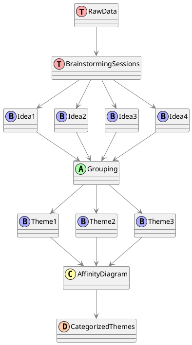
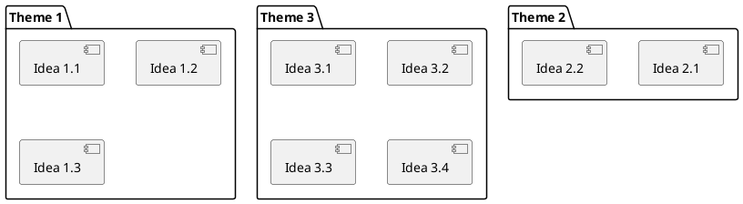

# Affinity Diagram

The Affinity Diagram is a technique used extensively in business analysis for ==organizing a large volume of information into manageable categories==. The technique aids in both problem-solving and decision-making by grouping data around common themes.

## In Context of Future State Considerations

In the context of defining future state considerations, affinity diagrams are often used to process and organize the abundant ideas and alternatives that may emerge. Typically, such discussions around future states start at a broad level. It could include various capabilities that might be essential for addressing the problem or opportunity under scrutiny. These ideas are often generated through brainstorming, which is considered a companion technique to affinity diagrams.

The use of affinity diagrams in this stage helps sift through the mass of information by classifying them into categories and subcategories based on their 'affinity' or relationship to each other. This organized clustering enables the product team to glean insights that may not be evident when considering the data in isolation. In problem-solving, specifically, affinity diagrams are beneficial for organizing related causes of a problem or opportunity. It provides a structured approach to exploring various avenues to address the issue.

## In Context of Identifying Design Options

When it comes to identifying design options, affinity diagrams can organize user stories, features, or requirements. The diagram aids in grouping similar designs, thereby assisting the decision-making process when multiple options are on the table. This technique also facilitates brainstorming new design ideas by categorizing existing information.

The organized categorization of design information into an affinity diagram helps stakeholders to gain a better understanding of available choices. It simplifies the process of selecting the most suitable design option for implementation, ensuring that the decision is aligned with user needs and project objectives.

## Visual Representation

For a visual representation of how affinity diagrams work, consider the following diagram:



<br/><br/>



The diagram delineates two major use-cases of affinity diagrams in the context of Business Analysis: Future State Considerations and Design Options. It shows how the affinity diagram technique can be integrated into different aspects of business analysis to achieve specific objectives.

## Other Representations

It's essential to remember that Affinity Diagrams are typically graphical or diagrammatic in nature. Here are a few other alternative ways to represent the data in an Affinity Diagram:

1. **Physical Sticky Notes:** This is a hands-on approach often used during workshops or collaborative sessions. Each idea or piece of data is written on a sticky note, and participants physically group them into themes by sticking them on a wall or board. This method allows for tangible, interactive collaboration.

2. **Digital Tools:** There are various digital tools and software designed explicitly for creating Affinity Diagrams. These tools offer pre-made templates and allow users to create and move digital cards or notes representing ideas and data. Some popular tools for this purpose include Miro, Lucidspark, and Microsoft Teams' whiteboard feature.

3. **Mind Mapping Software:** Mind mapping tools like MindMeister or XMind can be used to create digital Affinity Diagrams. You can create nodes for each idea and connect them hierarchically under thematic branches. This approach can provide a visual hierarchy of ideas.

4. **Matrix Diagrams:** Instead of a traditional hierarchical Affinity Diagram, you can represent your data using a matrix. In this approach, ideas or data points are listed both vertically and horizontally, and you mark intersections to indicate relationships or groupings. This method can be useful for capturing complex relationships.

5. **Hierarchical Diagrams:** Instead of grouping ideas into themes, you can create a hierarchical structure where ideas are organized based on subtopics or categories. This approach may be more suitable for situations where you want to show a more structured relationship between ideas.

6. **Flowcharts or Diagrams:** You can use flowchart or diagramming software to create a visual representation of the flow of ideas or data, showing how they are connected or lead to specific outcomes. This approach is particularly useful when there is a sequential or process-oriented aspect to the data.

The choice of representation method depends on the complexity of your data and the preferences of your team or stakeholders. Affinity Diagrams are highly flexible, and the goal is to visually organize information in a way that best suits your specific analysis needs and communication objectives.

---

## Quiz

```quiz
Question: In the context of Business Analysis, what is the primary purpose of using an Affinity Diagram?
A: To create a detailed project plan with timelines
B: To organize a large volume of information into manageable categories
C: To develop a comprehensive risk management strategy
D: To map out the organization's financial projections
Answer: B
Explanation: The primary purpose of an Affinity Diagram in Business Analysis is to organize a large volume of information into manageable categories, aiding in problem-solving and decision-making by grouping data around common themes.

Question: How does an Affinity Diagram aid in defining Future State Considerations?
A: By providing financial analysis for budget planning
B: By organizing ideas and alternatives for future capabilities
C: By establishing a direct communication channel with stakeholders
D: By setting specific technical requirements for IT systems
Answer: B
Explanation: In defining Future State Considerations, Affinity Diagrams are used to process and organize the abundant ideas and alternatives around future capabilities into categories and subcategories based on their affinity or relationship to each other.

Question: When identifying design options, what role does an Affinity Diagram play?
A: It is used to prioritize projects based on ROI
B: It organizes user stories and requirements into groups
C: It determines the final solution without further analysis
D: It directly implements chosen design options
Answer: B
Explanation: In identifying design options, Affinity Diagrams are used to organize user stories, features, or requirements into groups, assisting in the decision-making process when multiple design options are being considered.

Question: What is a common method used in workshops for creating an Affinity Diagram?
A: Using complex statistical analysis
B: Implementing a standard Gantt chart
C: Using physical sticky notes for interactive collaboration
D: Conducting formal corporate board meetings
Answer: C
Explanation: A common and interactive method used in workshops for creating an Affinity Diagram is using physical sticky notes. Each idea or piece of data is written on a sticky note, and participants group them into themes by sticking them on a wall or board.

Question: Which of the following is NOT a typical representation method for an Affinity Diagram?
A: Digital Tools like Miro or Lucidspark
B: Physical Sticky Notes during collaborative sessions
C: Hierarchical Diagrams to show structured relationships
D: A detailed financial ledger documenting expenses
Answer: D
Explanation: A detailed financial ledger documenting expenses is not a typical representation method for an Affinity Diagram. Affinity Diagrams are used for organizing information and ideas, not for financial record-keeping.
```
