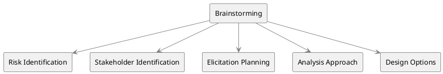

# Brainstorming

Brainstorming is a widely used elicitation technique in business analysis aimed at ==generating a plethora of ideas within a constrained time frame==. It serves various purposes across different stages and aspects of a project. Here’s a detailed understanding of how Brainstorming is applied in diverse contexts according to the PMI Guide to Business Analysis.

## Key Characteristics

1. **Group Environment**: Conducted in a group setting led by a facilitator.

2. **Rapid Idea Generation**: Enables the fast generation of ideas about a given topic or issue.

3. **Inclusivity**: All ideas are accepted; no idea is criticized or critiqued.

4. **Dynamic Interaction**: Group members build upon each other’s ideas to generate even more ideas.

5. **Facilitator's Role**: Ensures equitable participation and prevents any single individual from dominating the session.

6. **Documentation**: Ideas are recorded in real-time and are visible to all participants.

7. **Two-Part Process**: Comprises of idea generation followed by analysis to refine and organize ideas.

## Contexts and Applications

1. **Risk Identification**: Useful for quickly generating a list of potential risks that could affect the project.

2. **Stakeholder Identification**: Employed to build an initial list of stakeholder names or types.

3. **Elicitation Planning**: Used to identify sources from which to elicit information and to decide which elicitation techniques to employ.

4. **Analysis Approach**: Facilitates the identification of tools and techniques for analysis, even those that might not be in a business analyst's standard toolkit.

5. **Design Options**: Helps in identifying possible design alternatives and associated risks.

6. **Complement to Other Techniques**: Often used in conjunction with other elicitation techniques like focus groups or workshops.

## Benefits

1. **High Volume of Ideas**: Can produce a larger number of ideas compared to other techniques.

2. **Collaborative Synergy**: Group dynamics can lead to ideas that might not have been possible through individual thought.

3. **Flexibility**: Adaptable to various stages of the project lifecycle, from initiation to planning and execution.

4. **Quick Turnaround**: Enables quick generation and documentation of ideas, facilitating fast decision-making.

## Diagrammatic Representation



The diagram represents how Brainstorming serves different contexts in Business Analysis, from Risk Identification to Design Options.

The multifaceted nature of Brainstorming makes it a versatile tool in the business analyst’s repertoire. Properly facilitated, it leads to richer outputs and more comprehensive understanding of the problem domain, thereby aiding in better decision-making and planning.

## Quiz

```quiz
Question: During the initial stages of a new project, a Business Analyst decides to use brainstorming for stakeholder identification. What is the PRIMARY advantage of using this technique in this context?
A: It allows for detailed risk assessment and mitigation strategies.
B: It generates a high volume of potential stakeholder names or types quickly.
C: It focuses on the financial implications of stakeholder involvement.
D: It provides a detailed analysis of each identified stakeholder's influence.
Answer: B
Explanation: The primary advantage of using brainstorming for stakeholder identification is its ability to quickly generate a high volume of potential stakeholder names or types.

Question: When using brainstorming for elicitation planning, what role does the facilitator play in the session?
A: The facilitator primarily contributes ideas for elicitation techniques.
B: The facilitator ensures equitable participation and prevents dominance by any single individual.
C: The facilitator is responsible for documenting all the ideas generated.
D: The facilitator decides which ideas are relevant and disregards the rest.
Answer: B
Explanation: In a brainstorming session for elicitation planning, the facilitator's role is to ensure equitable participation and prevent any single individual from dominating the session.

Question: A Business Analysis team is brainstorming to identify tools and techniques for analysis. What is a key benefit of using brainstorming in this context?
A: It leads to the generation of a large number of tools and techniques.
B: It allows for a detailed cost-benefit analysis of each tool and technique.
C: It focuses on selecting the most cost-effective analysis tools.
D: It is used to determine the technical skills required for the project.
Answer: A
Explanation: A key benefit of using brainstorming to identify tools and techniques for analysis is that it leads to the generation of a large number of ideas.

Question: If a Business Analyst uses brainstorming to identify design options, what characteristic of the technique is most beneficial?
A: The ability to provide anonymity to participants.
B: The dynamic interaction where group members build upon each other's ideas.
C: The focus on financial aspects of different design options.
D: The facilitator's role in analyzing the feasibility of each idea.
Answer: B
Explanation: When using brainstorming to identify design options, the most beneficial characteristic is the dynamic interaction where group members build upon each other's ideas to generate even more options.

Question: What is a potential challenge when using brainstorming for risk identification in a project?
A: The process may be too time-consuming and detailed.
B: There might be a lack of collaboration and group dynamics.
C: The inability to criticize or critique ideas might lead to an overwhelming number of risks being listed without immediate prioritization.
D: The focus tends to shift towards stakeholder analysis rather than risk identification.
Answer: C
Explanation: A potential challenge in using brainstorming for risk identification is that the no-critique rule might lead to an overwhelming number of risks being listed without immediate prioritization.

```
