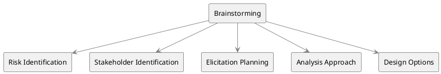

# Brainstorming

Brainstorming is a widely used elicitation technique in business analysis aimed at ==generating a plethora of ideas within a constrained time frame==. It serves various purposes across different stages and aspects of a project. Here’s a detailed understanding of how Brainstorming is applied in diverse contexts according to the PMI Guide to Business Analysis.

### Key Characteristics

1. **Group Environment**: Conducted in a group setting led by a facilitator.

2. **Rapid Idea Generation**: Enables the fast generation of ideas about a given topic or issue.

3. **Inclusivity**: All ideas are accepted; no idea is criticized or critiqued.

4. **Dynamic Interaction**: Group members build upon each other’s ideas to generate even more ideas.

5. **Facilitator's Role**: Ensures equitable participation and prevents any single individual from dominating the session.

6. **Documentation**: Ideas are recorded in real-time and are visible to all participants.

7. **Two-Part Process**: Comprises of idea generation followed by analysis to refine and organize ideas.

### Contexts and Applications

1. **Risk Identification**: Useful for quickly generating a list of potential risks that could affect the project.

2. **Stakeholder Identification**: Employed to build an initial list of stakeholder names or types.

3. **Elicitation Planning**: Used to identify sources from which to elicit information and to decide which elicitation techniques to employ.

4. **Analysis Approach**: Facilitates the identification of tools and techniques for analysis, even those that might not be in a business analyst's standard toolkit.

5. **Design Options**: Helps in identifying possible design alternatives and associated risks.

6. **Complement to Other Techniques**: Often used in conjunction with other elicitation techniques like focus groups or workshops.

### Benefits

1. **High Volume of Ideas**: Can produce a larger number of ideas compared to other techniques.

2. **Collaborative Synergy**: Group dynamics can lead to ideas that might not have been possible through individual thought.

3. **Flexibility**: Adaptable to various stages of the project lifecycle, from initiation to planning and execution.

4. **Quick Turnaround**: Enables quick generation and documentation of ideas, facilitating fast decision-making.

### Diagrammatic Representation

The diagram represents how Brainstorming serves different contexts in Business Analysis, from Risk Identification to Design Options.

The multifaceted nature of Brainstorming makes it a versatile tool in the business analyst’s repertoire. Properly facilitated, it leads to richer outputs and more comprehensive understanding of the problem domain, thereby aiding in better decision-making and planning.
