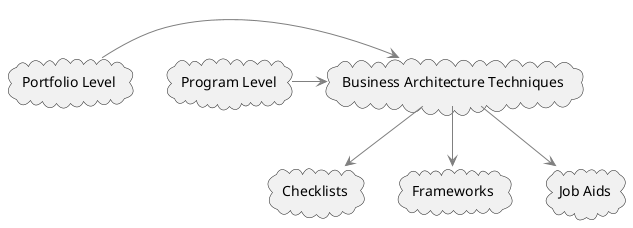

# Business Architecture Techniques

Business Architecture Techniques serve as critical tools in business analysis to understand and model the organizational structures, processes, and functions. They offer various approaches for examining different aspects of the business, including its capabilities, relationships, information flows, and value streams. These techniques are instrumental in assessing the current state of the business and guiding strategy decisions, particularly at the portfolio and program levels.

## Organizational Frameworks

Business architecture techniques are often presented as organizational frameworks. These frameworks could come in the form of checklists, procedural guides, or even more comprehensive models. The primary utility of such frameworks is to offer a structured approach to business analysis. They help in:

1. **Assessment**: Gauge the current state of the business, including its structures, processes, and various functions.

2. **Strategy Guidance**: Assist in the formulation and execution of strategies by highlighting gaps, redundancies, or opportunities at the portfolio and program levels.

3. **Alignment**: Ensure that business goals are in harmony with technical solutions and operational processes.

## Types of Business Architecture Techniques

1. **Checklists**: Serve as quick reference guides for ensuring that all critical aspects of the business architecture are considered.

2. **Frameworks**: Offer a more structured approach, breaking down the business into different components and describing how they interrelate.

3. **Job Aids**: Provide specific guidance or steps for tasks or responsibilities associated with business architecture.

## Utility at Portfolio and Program Levels

Business Architecture Techniques are especially useful for senior management and decision-makers within an organization. At the portfolio level, these techniques can assist in investment decisions and strategic alignment. They help to ensure that initiatives and projects within the portfolio contribute to the organizational strategy and goals. At the program level, these techniques guide the planning and execution of interrelated projects, ensuring cohesion and alignment with the broader business objectives.

## Diagrammatic Representation

To visualize how Business Architecture Techniques intersect with different organizational levels, consider this PlantUML diagram:



This diagram shows how Business Architecture Techniques can be manifested in the form of Checklists, Frameworks, or Job Aids. It also shows their applicability at the Portfolio and Program Levels.

Through the adept use of Business Architecture Techniques, business analysts and decision-makers can effectively understand the current state of the business, enabling them to make informed strategy decisions. This leads to a more aligned and efficient organization.

## Quiz

```quiz
Question: When considering Business Architecture Techniques, what primary utility do organizational frameworks offer?
A: They provide a means for rapid decision-making in operational contexts.
B: They offer a structured approach to Business Analysis by structuring business components.
C: They primarily focus on enhancing employee skills and competencies.
D: They are used for managing customer relationships and service delivery.
Answer: B
Explanation: Organizational frameworks in Business Architecture Techniques offer a structured approach to Business Analysis by breaking down and structuring business components.

Question: What role do Checklists play in Business Architecture Techniques?
A: They are used for detailed financial planning and budgeting.
B: Checklists serve as quick reference guides to ensure consideration of all critical aspects of the business architecture.
C: They are primarily utilized for employee performance evaluations.
D: Checklists are used for tracking customer interactions and feedback.
Answer: B
Explanation: In the context of Business Architecture Techniques, Checklists serve as quick reference guides to ensure all critical aspects of the business architecture are considered.

Question: How do Business Architecture Techniques aid in strategy guidance at the portfolio and program levels?
A: By providing entertainment and relaxation activities for employees.
B: Through detailed technical training and development programs.
C: They assist in strategy formulation and execution by highlighting gaps and opportunities.
D: By focusing exclusively on marketing strategies and customer engagement.
Answer: C
Explanation: Business Architecture Techniques aid in strategy guidance at the portfolio and program levels by assisting in the formulation and execution of strategies, highlighting gaps, redundancies, or opportunities.

Question: In what way are Job Aids significant in Business Architecture Techniques?
A: They are mainly used for organizing corporate social responsibility events.
B: Job Aids provide specific guidance or steps for tasks associated with business architecture.
C: They are designed for external stakeholder communication and public relations.
D: Their primary function is to manage stock inventory and supply chain logistics.
Answer: B
Explanation: Job Aids are significant in Business Architecture Techniques as they provide specific guidance or steps for tasks or responsibilities associated with business architecture.

Question: What is the importance of Business Architecture Techniques at the Portfolio Level within an organization?
A: They are essential for day-to-day operational management.
B: They assist in investment decisions and ensuring strategic alignment.
C: Their sole focus is on improving individual employee productivity.
D: They are used for managing real estate and physical assets of the company.
Answer: B
Explanation: At the Portfolio Level within an organization, Business Architecture Techniques are important as they assist in investment decisions and ensuring that initiatives and projects contribute to the organizational strategy and goals.
```
