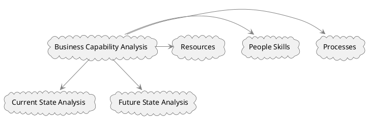

# Business Capability Analysis

It aimed at evaluating an organization's performance across various dimensions, including processes, people skills, and other resources. It serves as a tool for understanding how well an organization can execute its functions and achieve its objectives. This analysis is crucial for both assessing the current state and planning for the future state of an organization.

### Objective and Scope

The primary objective of Business Capability Analysis is to create a specification by which business capabilities can be assessed and monitored. The technique is rooted in data-driven analysis; historical data from current capabilities are gathered to comprehend performance trends. These data help establish performance standards that act as benchmarks for evaluating current and future state performance.

1. **Current State Analysis**: The focus is on understanding how well the existing capabilities are performing. Historical data offer insights into trends and set the stage for defining performance guidelines or standards.
2. **Future State Analysis**: In planning for the future, the specification developed during the current state analysis serves as a benchmark. This allows organizations to set targets for future capabilities and measure them against established performance standards.

### Analytical Components

1. **Processes**: The workflow, procedures, and methodologies employed in achieving business objectives.
2. **People Skills**: The competencies, expertise, and talent available within the organization.
3. **Resources**: Other assets like technology, infrastructure, and capital that contribute to organizational performance.

### Performance Standards

The historical data are instrumental in setting performance standards, which act as criteria for judging the effectiveness of a capability. These standards serve as reference points in both current and future state analyses, allowing for continuous performance measurement and monitoring.

### Diagrammatic Representation

Here's a corrected PlantUML diagram to visualize the components and focus areas of Business Capability Analysis.

This diagram shows that Business Capability Analysis involves both current and future state analyses and takes into account Processes, People Skills, and Resources to evaluate organizational performance.

Business Capability Analysis is a robust technique for gauging organizational capabilities, setting performance standards, and making data-driven decisions for both current and future states. It allows business analysts and decision-makers to construct a comprehensive view of an organization's ability to achieve its goals, thereby informing strategic decisions.
