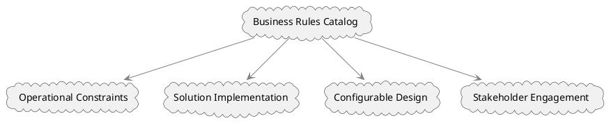

# Business Rules Catalog

A Business Rules Catalog serves as a structured repository that details business rules and their associated attributes. This is a form of rule model used in the realm of business analysis to delineate constraints and operational guidelines that are neither processes nor procedures but govern the behavior within a business's operations. It is a crucial asset for business analysts and decision-makers as it not only informs the development and implementation of solutions but also serves as a foundation for highly configurable designs.

## Importance of Business Rules Catalog

1. **Operational Constraints**: Business rules specify the constraints and regulations under which a business operates. They are not the actual processes but serve as guidelines for behavior.

2. **Solution Implementation**: Since these rules need to be enforced or implemented by any solution, understanding them is crucial for solution development.

3. **Configurable Design**: Business rules often change to support evolving business operations. Thus, they provide a strong rationale for designing highly configurable solutions that can adapt to these changes.

4. **Stakeholder Engagement**: Business stakeholders may have a vested interest in these rules, particularly when they influence or are influenced by business operations.

## Timing and Updates

The Business Rules Catalog is a dynamic document that can be created and updated at any point where business rules are identified or modified. This ensures that the catalog remains a relevant and accurate reflection of the rules governing the business.

## Attributes and Mapping

The catalog can track various attributes about each business rule. These attributes can differ based on the specific needs of a portfolio, program, or project. Moreover, Business Rules Catalogs can map each rule to related processes that enforce it or to data models that apply the rules, thereby establishing a clear linkage between rules and their operational or data contexts.

## Diagrammatic Representation

Here's a PlantUML diagram to visualize the components and relationships involved in a Business Rules Catalog.



This diagram shows how the Business Rules Catalog is closely related to operational constraints, solution implementation, configurable design, and stakeholder engagement.

## Sample Business Rules Catalog

Certainly, below is a table structure that could represent a Business Rules Catalog, featuring various attributes and example entries:

| BR ID | Attribute 1 | Attribute 2 | Example Attribute: Business Rule Title | Example Attribute: Business Rule Description                | Example Attribute: Type | Example Attribute: Reference |
| ----- | ----------- | ----------- | -------------------------------------- | ----------------------------------------------------------- | ----------------------- | ---------------------------- |
| BR001 | Value A     | Value B     | Maximum Order Limit                    | Limit of items that can be ordered is 1000                  | Operational             | Process X                    |
| BR002 | Value C     | Value D     | Employee Overtime                      | Employees are eligible for overtime after 40 hours per week | Regulatory              | Process Y                    |
| BR003 | Value E     | Value F     | Customer Age Requirement               | Customers must be at least 18 years old to place an order   | Legal                   | Process Z                    |
| BR004 | Value G     | Value H     | Return Policy                          | Products can be returned within 30 days of purchase         | Operational             | Process A                    |

In this example:

- **BR ID**: Unique identifier for each business rule.
- **Attribute 1 and 2**: Additional attributes that might be specific to a portfolio, program, or project.
- **Example Attribute: Business Rule Title**: The title or name of the business rule.
- **Example Attribute: Business Rule Description**: A brief description of what the business rule entails.
- **Example Attribute: Type**: The type or category of the business rule (Operational, Regulatory, Legal, etc.)
- **Example Attribute: Reference**: Processes or data models that are tied to the business rule, serving as a reference for implementation or enforcement.

This table serves as a comprehensive snapshot of business rules along with their attributes, thereby aiding in the understanding, implementation, and management of these rules.

---

Business Rules Catalog serves as a vital tool for capturing, organizing, and managing the business rules that dictate how an organization functions. It has significant implications for how solutions are designed, implemented, and maintained, making it an indispensable resource in the toolbox of business analysis.

## Quiz

```quiz
Question: What is the primary purpose of a Business Rules Catalog in business analysis?
A: To define the financial budget and resource allocation of the project
B: To detail business rules and their attributes for informing solution development
C: To establish the project's legal and compliance framework
D: To outline the project's communication and marketing strategy
Answer: B
Explanation: A Business Rules Catalog serves as a repository that details business rules and their associated attributes, informing the development and implementation of solutions and acting as a guide for behavior within business operations.

Question: How do business rules within the catalog impact solution design and implementation?
A: They dictate the financial aspects of the solution
B: They specify operational guidelines and constraints for the solution
C: They focus solely on the aesthetic aspects of the solution
D: They are irrelevant to solution design
Answer: B
Explanation: Business rules specify the operational constraints and guidelines under which a business operates, influencing the design and implementation of solutions to ensure adherence to these rules.

Question: What is the importance of designing highly configurable solutions in relation to business rules?
A: Business rules often change, necessitating adaptable solutions
B: Configurable solutions are only important for aesthetic reasons
C: Business rules are static and never change
D: Configurable solutions are less important than fixed solutions
Answer: A
Explanation: Due to the evolving nature of business rules, designing highly configurable solutions is important, as they allow for adaptability to changes in these rules.

Question: How is stakeholder engagement related to the Business Rules Catalog?
A: Stakeholders are not involved in business rules
B: Stakeholders may have a vested interest in business rules affecting operations
C: Stakeholder engagement solely focuses on financial aspects
D: Stakeholder engagement is only about legal compliance
Answer: B
Explanation: Business stakeholders often have a vested interest in business rules, particularly when these rules influence or are influenced by business operations, necessitating their engagement in the catalog.

Question: What role does the Business Rules Catalog play in mapping business rules?
A: It is irrelevant to business rule mapping
B: It maps rules to related processes or data models for operational context
C: It only maps rules based on their financial implications
D: It focuses on mapping the aesthetic aspects of rules
Answer: B
Explanation: The Business Rules Catalog can map each business rule to related processes that enforce it or to data models that apply the rules, establishing a clear linkage between the rules and their operational or data contexts.
```
