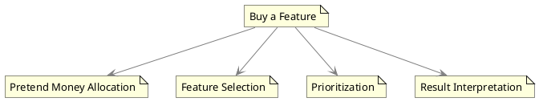

# Buy A Feature

"Buy a Feature" is a collaborative prioritization technique often used in business analysis to engage stakeholders in determining the value and importance of various features in a product or project. This technique falls under the category of collaborative games and serves as a facilitation method aimed at achieving stakeholder consensus on feature prioritization.

### How It Works

1. **Pretend Money Allocation**: Each stakeholder is given an amount of pretend money.

2. **Feature Selection**: Stakeholders use this pretend money to "buy" features they consider important or valuable. They can distribute their allotted money across multiple features based on their priorities.

3. **Prioritization**: Once all stakeholders have spent their pretend money, the amount allocated to each feature is tallied up.

4. **Result Interpretation**: The features that attract the most money from stakeholders are considered to be the most valuable and thus are the highest-prioritized for development or inclusion.

### Importance and Use Cases

1. **Stakeholder Engagement**: It ensures active participation from all stakeholders, which is essential for capturing diverse viewpoints.

2. **Consensus Building**: By using a game-like setup, it facilitates easier consensus among stakeholders, reducing the complexity often associated with feature prioritization discussions.

3. **Transparency**: The process is transparent, and it provides stakeholders with clear visibility into what features are considered most valuable by the group.

4. **Resource Allocation**: This method can be particularly useful when there are resource constraints, and there is a need to focus on the most impactful features.

### Diagrammatic Representation

To visualize the "Buy a Feature" technique and its relationships, consider the following PlantUML diagram:

In summary, "Buy a Feature" is an effective technique for collaboratively prioritizing features, especially in contexts where stakeholder agreement is critical for project success. By transforming the prioritization process into a collaborative game, it not only engages stakeholders but also simplifies the complexities tied to traditional prioritization methods.
