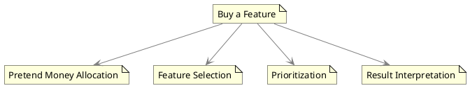

# Buy A Feature

"Buy a Feature" is a collaborative prioritization technique often used in business analysis to engage stakeholders in determining the value and importance of various features in a product or project. This technique falls under the category of collaborative games and serves as a facilitation method aimed at achieving stakeholder consensus on feature prioritization.

## How It Works

1. **Pretend Money Allocation**: Each stakeholder is given an amount of pretend money.

2. **Feature Selection**: Stakeholders use this pretend money to "buy" features they consider important or valuable. They can distribute their allotted money across multiple features based on their priorities.

3. **Prioritization**: Once all stakeholders have spent their pretend money, the amount allocated to each feature is tallied up.

4. **Result Interpretation**: The features that attract the most money from stakeholders are considered to be the most valuable and thus are the highest-prioritized for development or inclusion.

## Importance and Use Cases

1. **Stakeholder Engagement**: It ensures active participation from all stakeholders, which is essential for capturing diverse viewpoints.

2. **Consensus Building**: By using a game-like setup, it facilitates easier consensus among stakeholders, reducing the complexity often associated with feature prioritization discussions.

3. **Transparency**: The process is transparent, and it provides stakeholders with clear visibility into what features are considered most valuable by the group.

4. **Resource Allocation**: This method can be particularly useful when there are resource constraints, and there is a need to focus on the most impactful features.

## Diagrammatic Representation

To visualize the "Buy a Feature" technique and its relationships, consider the following PlantUML diagram:



In summary, "Buy a Feature" is an effective technique for collaboratively prioritizing features, especially in contexts where stakeholder agreement is critical for project success. By transforming the prioritization process into a collaborative game, it not only engages stakeholders but also simplifies the complexities tied to traditional prioritization methods.

## Quiz

```quiz
Question: What is the primary objective of the "Buy a Feature" technique in business analysis?
A: To establish the project's legal framework
B: To engage stakeholders in prioritizing features based on perceived value
C: To define the project's financial budget
D: To outline the project's communication strategy
Answer: B
Explanation: "Buy a Feature" is a collaborative prioritization technique used to engage stakeholders in a game-like activity to determine the value and importance of various features, facilitating consensus on feature prioritization.

Question: How does the "Buy a Feature" technique work in a prioritization setting?
A: Stakeholders use pretend money to "buy" features, prioritizing them based on allocated amounts
B: Features are randomly selected without any stakeholder input
C: It focuses solely on the financial aspects of features
D: It prioritizes features based only on their aesthetic appeal
Answer: A
Explanation: In the "Buy a Feature" technique, stakeholders are given pretend money which they use to "buy" features they find important. The features that attract the most money are then prioritized based on this stakeholder input.

Question: What benefit does the "Buy a Feature" technique provide in terms of stakeholder engagement?
A: It excludes stakeholders from the prioritization process
B: It ensures active participation from all stakeholders
C: It focuses solely on engaging financial stakeholders
D: It is a transparent process but does not engage stakeholders
Answer: B
Explanation: "Buy a Feature" ensures active participation from all stakeholders, capturing diverse viewpoints and engaging them in the prioritization process, making it an effective method for stakeholder involvement.

Question: Why is the "Buy a Feature" technique useful in scenarios with resource constraints?
A: It helps focus on the most impactful features when resources are limited
B: It is only useful when there are unlimited resources
C: It disregards resource constraints
D: It focuses solely on aesthetic features regardless of resources
Answer: A
Explanation: The "Buy a Feature" technique is particularly useful in scenarios with resource constraints as it helps identify and focus on the most impactful features, based on the collective valuation by stakeholders.

Question: How does the "Buy a Feature" technique aid in consensus building among stakeholders?
A: By using a game-like setup to facilitate easier agreement on feature prioritization
B: It complicates the consensus-building process
C: It builds consensus solely on financial aspects
D: It focuses on building consensus only on aesthetic aspects
Answer: A
Explanation: The game-like setup of the "Buy a Feature" technique facilitates easier consensus among stakeholders, making the process of feature prioritization more engaging and less complex.
```
