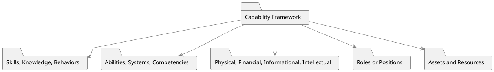

# Capability Framework

A Capability Framework serves as a structured guide for understanding and evaluating the key skills, competencies, and resources that are crucial for an organization's operational effectiveness and strategic growth. This framework can analyze capabilities in two key dimensions: people and products.

## Key Components

- **Skills, Knowledge, and Behaviors**: Descriptions of what is needed in terms of human skills and understanding.
- **Abilities, Systems, Competencies**: Specifies what abilities or systems are essential for executing specific tasks or roles effectively.
- **Physical, Financial, Informational, Intellectual Capabilities**: Types of capabilities that might be relevant, depending on the organizational context.

- **Roles or Positions**: When it comes to people, capabilities are often outlined based on different roles or positions in the organization.
- **Assets and Resources**: Descriptions of any tangible or intangible assets that enable or support the capabilities under analysis.
- **Maturity Models**: Some organizations use the term 'maturity models' synonymously with capability frameworks.

## Applications

1. **Training and Development**: Identifying the capabilities needed helps to develop relevant training programs.

2. **Hiring and Recruitment**: Knowing the capabilities required assists HR in finding the right fit for roles.

3. **Resource Allocation**: Helps in efficiently assigning human or other resources to processes, projects, or departments.

4. **Gap Analysis**: Used for determining the capabilities that are lacking but are needed to move from the current state to the desired future state.

## PlantUML Diagram



## Sample Tables

**Analyzing People Capabilities**

| Business Analyst | Entry Level | Intermediate | Senior I | Senior II | Senior III |
| ---------------- | ----------- | ------------ | -------- | --------- | ---------- |
| Capability 1     |             |              |          |           |            |
| Capability 2     |             |              |          |           |            |
| Capability 3     |             |              |          |           |            |

**Analyzing Product Capabilities**

| Categories to Be Measured | Level 0 | Level 1 | Level 2 | Level 3 |
| ------------------------- | ------- | ------- | ------- | ------- |
| People                    |         |         |         |         |
| Process                   |         |         |         |         |
| Technology                |         |         |         |         |

These tables serve as formats for capturing the capability information, and they can be tailored to meet specific organizational needs. Whether it's a matter of people or product capabilities, these tables offer a structured method for performing a comprehensive analysis.

## Quiz

```quiz
Question: What is the primary purpose of a Capability Framework in an organization?
A: To organize corporate social events and activities.
B: Guiding understanding and evaluation of key skills and resources.
C: Managing the company's online presence and digital marketing.
D: Overseeing the distribution and logistics of products.
Answer: B
Explanation: A Capability Framework serves to guide the understanding and evaluation of key skills, competencies, and resources crucial for an organization's operational effectiveness and strategic growth.

Question: In a Capability Framework, how are capabilities related to people often outlined?
A: Based on customer preferences and feedback.
B: According to different roles or positions in the organization.
C: By the company's financial performance metrics.
D: Following the latest technology and innovation trends.
Answer: B
Explanation: In a Capability Framework, capabilities related to people are often outlined based on different roles or positions within the organization.

Question: How does a Capability Framework assist in the area of Training and Development?
A: By focusing exclusively on product marketing strategies.
B: Through identifying necessary capabilities for relevant training programs.
C: In managing office maintenance and facilities.
D: By tracking sales targets and market share growth.
Answer: B
Explanation: A Capability Framework helps in Training and Development by identifying the capabilities needed, thereby guiding the development of relevant training programs.

Question: What role does a Capability Framework play in Hiring and Recruitment?
A: It assists in planning corporate travel and events.
B: It helps HR in finding the right fit for roles by knowing required capabilities.
C: The framework is used for evaluating competitor strategies.
D: It is primarily used for financial auditing and compliance.
Answer: B
Explanation: In Hiring and Recruitment, a Capability Framework assists HR by providing insights into the capabilities required, aiding in finding the right fit for various roles.

Question: What is the significance of including Maturity Models in a Capability Framework?
A: They are used for managing external vendor relations.
B: Maturity Models are synonymous with capability frameworks in some organizations.
C: Their primary use is in tracking stock market performance.
D: They are essential for organizing customer loyalty programs.
Answer: B
Explanation: Some organizations use the term 'Maturity Models' synonymously with Capability Frameworks, highlighting their importance in assessing organizational capabilities.

```
