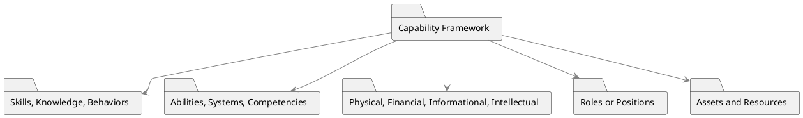

# Capability Framework

A Capability Framework serves as a structured guide for understanding and evaluating the key skills, competencies, and resources that are crucial for an organization's operational effectiveness and strategic growth. This framework can analyze capabilities in two key dimensions: people and products.

### Key Components

- **Skills, Knowledge, and Behaviors**: Descriptions of what is needed in terms of human skills and understanding.
- **Abilities, Systems, Competencies**: Specifies what abilities or systems are essential for executing specific tasks or roles effectively.
- **Physical, Financial, Informational, Intellectual Capabilities**: Types of capabilities that might be relevant, depending on the organizational context.

- **Roles or Positions**: When it comes to people, capabilities are often outlined based on different roles or positions in the organization.
- **Assets and Resources**: Descriptions of any tangible or intangible assets that enable or support the capabilities under analysis.
- **Maturity Models**: Some organizations use the term 'maturity models' synonymously with capability frameworks.

### Applications

1. **Training and Development**: Identifying the capabilities needed helps to develop relevant training programs.

2. **Hiring and Recruitment**: Knowing the capabilities required assists HR in finding the right fit for roles.

3. **Resource Allocation**: Helps in efficiently assigning human or other resources to processes, projects, or departments.

4. **Gap Analysis**: Used for determining the capabilities that are lacking but are needed to move from the current state to the desired future state.

### PlantUML Diagram

### Sample Tables

**Analyzing People Capabilities**

| Business Analyst | Entry Level | Intermediate | Senior I | Senior II | Senior III |
| ---------------- | ----------- | ------------ | -------- | --------- | ---------- |
| Capability 1     |             |              |          |           |            |
| Capability 2     |             |              |          |           |            |
| Capability 3     |             |              |          |           |            |

**Analyzing Product Capabilities**

| Categories to Be Measured | Level 0 | Level 1 | Level 2 | Level 3 |
| ------------------------- | ------- | ------- | ------- | ------- |
| People                    |         |         |         |         |
| Process                   |         |         |         |         |
| Technology                |         |         |         |         |

These tables serve as formats for capturing the capability information, and they can be tailored to meet specific organizational needs. Whether it's a matter of people or product capabilities, these tables offer a structured method for performing a comprehensive analysis.
