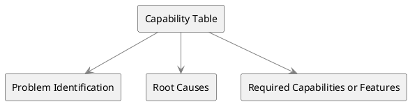

# Capability Table

Capability Tables serve as a robust technique for representing and analyzing an organization's capabilities in both the current and future states. The table draws connections between existing problems, their root causes, and the capabilities needed to address those problems effectively. The technique is employed to create a seamless flow of information from the current state analysis to future state discussions.

## Key Components

- **Problem Identification**: Lists the problems that are limiting the performance or causing issues within the current state of the organization.

- **Root Causes**: Specifies the underlying causes that have led to each identified problem.

- **Required Capabilities or Features**: Highlights the capabilities or features that are needed to solve each problem, bridging the gap between the current and future states.

## Applications

1. **Future-State Analysis**: Utilized to define the capabilities necessary for solving current problems and capitalizing on new opportunities.

2. **Root Cause Analysis**: Helps in pinpointing the root causes of existing problems, thereby offering clarity for devising solutions.

3. **Current State vs. Future State**: Provides an integrated view that links the present problems and root causes with the features or capabilities required for future state achievement.

## PlantUML Diagram



## Sample Format Table for Capability Table

| Problem Identification           | Root Causes                 | Required Capabilities or Features      |
| -------------------------------- | --------------------------- | -------------------------------------- |
| Declining Customer Satisfaction  | Poor Customer Support       | Enhanced Customer Support Training     |
| Inefficient Inventory Management | Outdated Inventory System   | Implement Advanced Inventory System    |
| Low Employee Morale              | Lack of Training Programs   | Develop Comprehensive Training Program |
| High Operational Costs           | Manual Data Entry Processes | Automate Data Entry Processes          |
| Decreased Market Share           | Limited Product Offerings   | Product Diversification                |

The table provides a sample dataset where various business problems are listed along with their root causes and the capabilities or features required to address them. This aids in drawing a clear line of action for transitioning from the current state to the desired future state.

## Quiz

```quiz
Question: What is the primary function of Capability Tables in business analysis?
A: To manage employee performance metrics and reviews.
B: Representing and analyzing organizational capabilities.
C: Tracking financial transactions and accounting records.
D: Organizing marketing campaigns and customer outreach.
Answer: B
Explanation: Capability Tables are used to represent and analyze an organization's capabilities in both current and future states, linking problems, root causes, and needed capabilities.

Question: In Capability Tables, what is the significance of identifying root causes?
A: To enhance the organization's social media presence.
B: To specify causes leading to identified problems.
C: For arranging corporate events and team outings.
D: In managing inventory and supply chain logistics.
Answer: B
Explanation: In Capability Tables, identifying root causes is significant as it specifies the underlying causes that have led to each identified problem.

Question: How do Capability Tables aid in Future-State Analysis?
A: By focusing on redesigning the company logo and branding.
B: Defining necessary capabilities for solving current problems.
C: Managing day-to-day administrative and clerical tasks.
D: Directing recreational activities and employee wellness programs.
Answer: B
Explanation: Capability Tables are utilized in Future-State Analysis to define the capabilities necessary for solving current problems and capitalizing on new opportunities.

Question: What aspect of Capability Tables provides an integrated view of the current and future states?
A: Linking present problems and root causes with required features.
B: Organizing office spaces and employee workstations for efficiency.
C: Conducting customer satisfaction surveys and feedback.
D: Managing public relations and external communications for the company.
Answer: A
Explanation: Capability Tables provide an integrated view by linking present problems and root causes with the features or capabilities required for future state achievement.

Question: How are Capability Tables employed in Root Cause Analysis?
A: They are used for conducting financial audits and compliance checks.
B: Pinpointing root causes of existing problems for solution clarity.
C: In arranging travel and logistics for business meetings.
D: For updating and maintaining IT and software systems.
Answer: B
Explanation: Capability Tables help in Root Cause Analysis by pinpointing the root causes of existing problems, thereby offering clarity for devising solutions.

```
