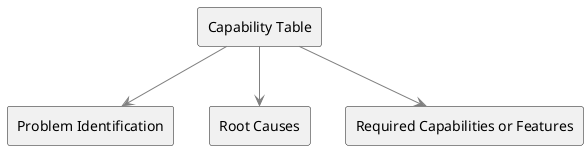

# Capability Table

Capability Tables serve as a robust technique for representing and analyzing an organization's capabilities in both the current and future states. The table draws connections between existing problems, their root causes, and the capabilities needed to address those problems effectively. The technique is employed to create a seamless flow of information from the current state analysis to future state discussions.

### Key Components

- **Problem Identification**: Lists the problems that are limiting the performance or causing issues within the current state of the organization.

- **Root Causes**: Specifies the underlying causes that have led to each identified problem.

- **Required Capabilities or Features**: Highlights the capabilities or features that are needed to solve each problem, bridging the gap between the current and future states.

### Applications

1. **Future-State Analysis**: Utilized to define the capabilities necessary for solving current problems and capitalizing on new opportunities.

2. **Root Cause Analysis**: Helps in pinpointing the root causes of existing problems, thereby offering clarity for devising solutions.

3. **Current State vs. Future State**: Provides an integrated view that links the present problems and root causes with the features or capabilities required for future state achievement.

### PlantUML Diagram

### Sample Format Table for Capability Table

| Problem Identification           | Root Causes                 | Required Capabilities or Features      |
| -------------------------------- | --------------------------- | -------------------------------------- |
| Declining Customer Satisfaction  | Poor Customer Support       | Enhanced Customer Support Training     |
| Inefficient Inventory Management | Outdated Inventory System   | Implement Advanced Inventory System    |
| Low Employee Morale              | Lack of Training Programs   | Develop Comprehensive Training Program |
| High Operational Costs           | Manual Data Entry Processes | Automate Data Entry Processes          |
| Decreased Market Share           | Limited Product Offerings   | Product Diversification                |

The table provides a sample dataset where various business problems are listed along with their root causes and the capabilities or features required to address them. This aids in drawing a clear line of action for transitioning from the current state to the desired future state.
