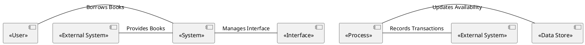

# Context Diagram

A Context Diagram serves as a visual tool for depicting the scope of a system, including all direct system-to-system and human-to-system interfaces. This high-level representation is essential for setting boundaries and understanding how various systems and actors interact with the focus system.

### Key Components

- **System Under Development**: Usually represented as a central circle, this is the system for which the context is being defined.

- **Interfacing Systems**: Displayed as boxes, these are systems that interact directly with the central system.

- **Human Actors**: These are the people or roles that interact with the system, represented by people shapes or boxes.

- **Lines**: Represent the interfaces or data flows between entities, detailing the kind of data or inputs/outputs exchanged.

### Usage

Context diagrams are especially valuable at the early stages of a project for defining scope and understanding all external touchpoints between the system under scrutiny and other systems or people. By doing so, they provide a foundation for identifying interface requirements and data requirements.

### Relationship to Requirements

Although context diagrams don't specify requirements per se, they do provide invaluable context that guides the identification and elicitation of requirements. By explicitly showing all interfaces, they can help pinpoint when and where interface requirements need to be gathered. This often serves as a precursor to more detailed models like system interface tables, user interface flows, and display-action-response models, which are then used to specify interface requirements in detail.

### As-Is and To-Be States

Context diagrams can be employed to model both the current ("as-is") and future ("to-be") states of a system. This dual representation is often leveraged in gap analysis to understand what needs to be changed or developed to transition from the current to the future state.

### Advantages

- **Simplicity**: Easy to construct and interpret, making it accessible to stakeholders at various levels of technical expertise.

- **Clarity**: Provides a clear, high-level view of system interactions, which can be particularly useful for stakeholders who are not immersed in the details.

- **Versatility**: Can be applied to different types of projects and is not restricted to any specific methodology.

### Diagram

Context diagrams are an essential tool in the toolkit of a business analyst, offering a clear and simple way to delineate system scope and understand intricate system interactions.
