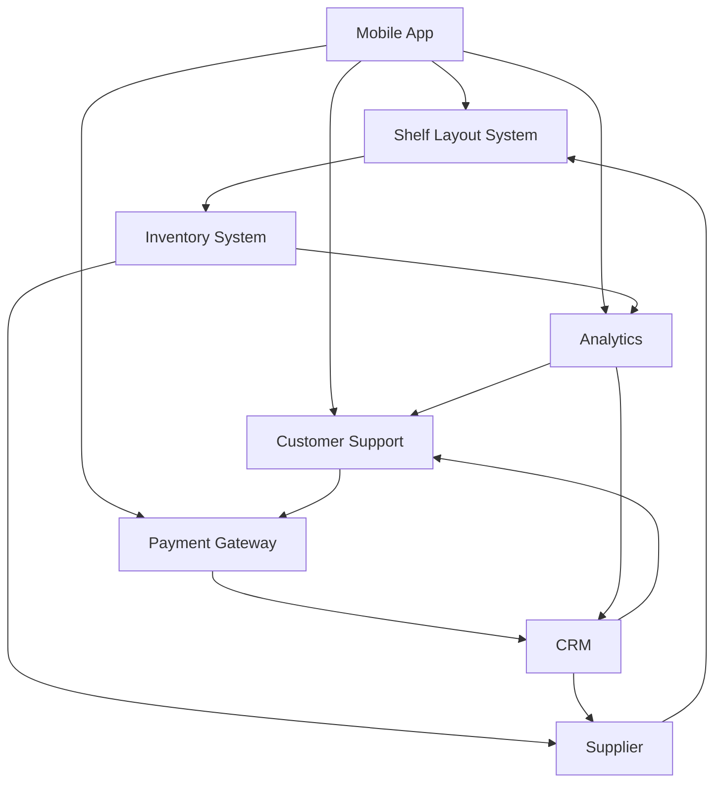

# Ecosystem Map

An Ecosystem Map serves as a scope model that provides a comprehensive view of all the relevant systems and their relationships with each other. It is instrumental in understanding the full scope of influence surrounding the systems that are in focus for the project, portfolio, or program. The systems in an Ecosystem Map are logical systems, capturing the business view as opposed to the physical or architectural perspective. Optional elements include data objects that may be passed between these systems.

### Usage

The primary use of an Ecosystem Map is to understand all the systems that could be affected by or that could impact the in-scope systems for the project. It helps in identifying potential interface requirements or data requirements for systems that either directly interface with the solution or are upstream or downstream from it. Ecosystem Maps are particularly useful in the early stages of a project. Unlike a Context Diagram, which generally focuses on direct interfaces, an Ecosystem Map can include systems that do not directly interface with the solution but may still impact it. For example, if a mobile application interfaces with a shelf layout system, an Ecosystem Map could also show an inventory system that supplies data to the shelf layout system but does not directly interface with the mobile application.

### Relationship to Requirements

While the Ecosystem Map provides a high-level view, it does not inherently specify requirements. After mapping out the ecosystem, System Interface Tables should be developed for each identified interface to drill down into the specifics. Similarly, Data Models should be created to outline the data requirements for each of the data objects that are passed between the systems. This helps in transforming high-level understanding into actionable requirements.

### Example

Consider an Ecosystem Map for a grocery store solution that includes various systems like a Mobile App, Shelf Layout System, Inventory System, and Payment Gateway. While the Mobile App directly interfaces with the Shelf Layout System and Payment Gateway, it may not interface with the Inventory System. However, the Inventory System is crucial for the Shelf Layout System. In this scenario, even if the Inventory System does not directly interface with the Mobile App, it would still be included in the Ecosystem Map to show the complete picture of systems affecting or being affected by the Mobile App.

By leveraging an Ecosystem Map, the business analyst gains insights into the interrelationships among different systems and can anticipate potential issues or dependencies that may otherwise have been overlooked. This comprehensive understanding aids in effective requirements elicitation and analysis.

