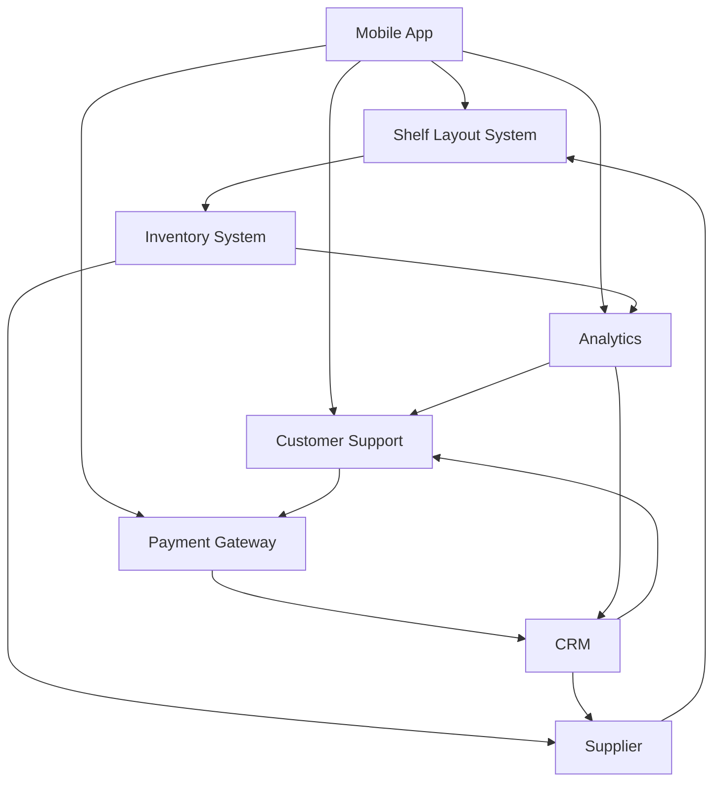

# Ecosystem Map

An Ecosystem Map serves as a scope model that provides a comprehensive view of all the relevant systems and their relationships with each other. It is instrumental in understanding the full scope of influence surrounding the systems that are in focus for the project, portfolio, or program. The systems in an Ecosystem Map are logical systems, capturing the business view as opposed to the physical or architectural perspective. Optional elements include data objects that may be passed between these systems.

## Usage

The primary use of an Ecosystem Map is to understand all the systems that could be affected by or that could impact the in-scope systems for the project. It helps in identifying potential interface requirements or data requirements for systems that either directly interface with the solution or are upstream or downstream from it. Ecosystem Maps are particularly useful in the early stages of a project. Unlike a Context Diagram, which generally focuses on direct interfaces, an Ecosystem Map can include systems that do not directly interface with the solution but may still impact it. For example, if a mobile application interfaces with a shelf layout system, an Ecosystem Map could also show an inventory system that supplies data to the shelf layout system but does not directly interface with the mobile application.

## Relationship to Requirements

While the Ecosystem Map provides a high-level view, it does not inherently specify requirements. After mapping out the ecosystem, System Interface Tables should be developed for each identified interface to drill down into the specifics. Similarly, Data Models should be created to outline the data requirements for each of the data objects that are passed between the systems. This helps in transforming high-level understanding into actionable requirements.

## Example

Consider an Ecosystem Map for a grocery store solution that includes various systems like a Mobile App, Shelf Layout System, Inventory System, and Payment Gateway. While the Mobile App directly interfaces with the Shelf Layout System and Payment Gateway, it may not interface with the Inventory System. However, the Inventory System is crucial for the Shelf Layout System. In this scenario, even if the Inventory System does not directly interface with the Mobile App, it would still be included in the Ecosystem Map to show the complete picture of systems affecting or being affected by the Mobile App.

By leveraging an Ecosystem Map, the business analyst gains insights into the interrelationships among different systems and can anticipate potential issues or dependencies that may otherwise have been overlooked. This comprehensive understanding aids in effective requirements elicitation and analysis.



## Quiz

```quiz
Question: When initiating a project to develop a new online banking platform, a business analyst needs to understand the entire landscape of related systems and their interrelationships. Which tool would be most effective for this purpose?
A: Risk Register
B: Ecosystem Map
C: Gantt Chart
D: Fishbone Diagram
Answer: B
Explanation: An Ecosystem Map is a scope model that provides a comprehensive view of all relevant systems and their relationships, making it an ideal tool for understanding the landscape of related systems in the development of an online banking platform.

Question: What is a primary function of an Ecosystem Map in the context of business analysis?
A: To schedule project tasks and milestones in a timeline format
B: To provide a high-level view of all systems affecting or impacted by the in-scope systems
C: To allocate budget across various project components and activities based on their priority
D: To assign roles and responsibilities to team members and stakeholders in the project
Answer: B
Explanation: The primary function of an Ecosystem Map in business analysis is to provide a comprehensive, high-level view of all systems that could be affected by or that could impact the in-scope systems for a project.

Question: In the early stages of a project, how does an Ecosystem Map differ from a Context Diagram?
A: An Ecosystem Map covers direct and indirect system interfaces; a Context Diagram only includes direct interfaces
B: An Ecosystem Map is used for budget planning, while a Context Diagram is used for scheduling project milestones
C: An Ecosystem Map assigns team roles, while a Context Diagram defines project scope and boundaries
D: An Ecosystem Map focuses on risk analysis, while a Context Diagram maps out project stakeholders and their roles
Answer: A
Explanation: Unlike a Context Diagram, which generally focuses on direct interfaces, an Ecosystem Map can include systems that do not directly interface with the solution but may still impact it, providing a broader view of the ecosystem.

Question: What should a business analyst do after mapping out the ecosystem with an Ecosystem Map to specify requirements?
A: Develop System Interface Tables for each identified interface
B: Create a detailed project budget, allocating resources to different project areas
C: Assign tasks to the project team based on the map
D: Schedule project milestones according to the map and its dependencies
Answer: A
Explanation: After mapping out the ecosystem with an Ecosystem Map, a business analyst should develop System Interface Tables for each identified interface to drill down into the specifics, thereby helping in transforming the high-level understanding into actionable requirements.

Question: Why is an Ecosystem Map crucial for anticipating potential issues in a project?
A: It helps in financial forecasting for the project and its components
B: It offers insights into system interrelationships and anticipates dependencies
C: It outlines the detailed steps for project implementation and execution
D: It allocates resources to different project areas based on their priority
Answer: B
Explanation: An Ecosystem Map is crucial for anticipating potential issues in a project as it provides insights into the interrelationships among different systems, allowing the business analyst to anticipate potential issues or dependencies that might impact the project.
```
