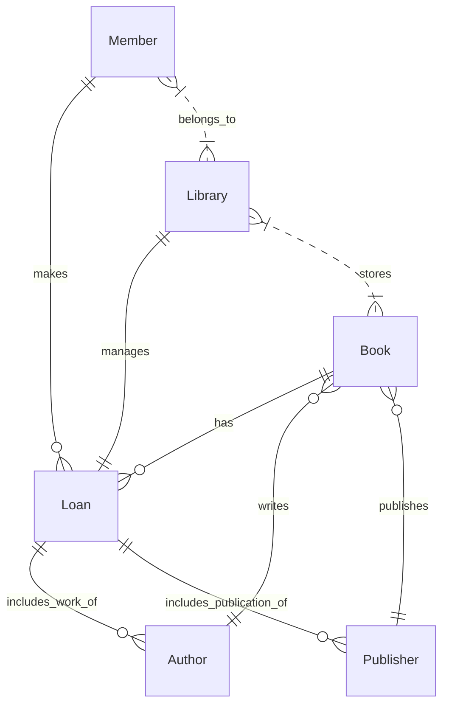

# Entity Relationship Diagram (ERD)

The Entity Relationship Diagram (ERD), also known as a business data diagram, serves as a data model to visually represent the various business data objects involved in a product or project, along with their cardinality relationships. These business data objects could be entities like customers, orders, or products that the business deals with. It is important to note that these objects are conceptual and represent what the business focuses on; they are not exact data objects or database tables.

Cardinality is a crucial concept in ERDs. It defines how many instances of one entity relate to instances of another entity. Cardinality can be expressed in various notations such as crow’s foot notation or using symbols like 0 (for none), 1 (for one), and n (for many). Cardinality essentially informs whether the relationship between entities is "one-to-one", "one-to-many", or "many-to-many", and whether these relationships are mandatory or optional.

In an ERD, business data objects are usually depicted as rectangles, relationships are represented by lines connecting these rectangles, and cardinality is indicated by labels or symbols on these lines. This graphical representation aids in comprehending the scope of the data that is part of the system. It helps in understanding what data will be created, consumed, or manipulated by the system. It also provides insight into any business rules that govern these data objects.

ERDs are generally created early in the analysis phase to establish a clear understanding of the scope of data. This scoping is not only beneficial for the business analysts but is often vital for database designers and architects for subsequent database design phases.

In conjunction with process models, ERDs can offer a more comprehensive view by modeling data from a process perspective. For instance, if there is a process model that describes how customer orders are processed, the ERD can show what kind of data is created or modified during this process, like creating new customer records or updating inventory levels.

To summarize, an Entity Relationship Diagram serves as a vital tool for understanding and modeling the business data objects, their relationships, and cardinality, thereby assisting in the data analysis, scope definition, and subsequent phases like database design.

## Example

Below is a ERD diagram involving multiple entities for a hypothetical Library Management System. Entities involved are 'Book', 'Author', 'Publisher', 'Library', 'Member', and 'Loan'.



In this diagram:

- The `Book` entity is related to `Loan` with an "optional to many" relationship, indicating a book may or may not be on loan.

- The `Member` entity is also related to `Loan` with an "optional to many" relationship, suggesting a member may or may not make loans.

- The `Library` entity has a "mandatory to mandatory" relationship with `Loan`, meaning each loan must be managed by one library, and each library must manage at least one loan.

- The `Author` entity has an "optional to many" relationship with `Book`, meaning an author can write zero or many books.

- The `Publisher` entity is related to `Book` with an "optional to many" relationship, meaning a publisher can publish zero or many books.

- The `Library` and `Book` entities have a non-specific relationship, suggesting that a library stores books.

- The `Member` entity is related to `Library` with a non-specific relationship, suggesting that a member belongs to a library.

- The `Loan` entity is related to both `Author` and `Publisher` with an "optional to many" relationship, indicating that a loan may include works from zero or many authors and publications from zero or many publishers.

This complex ERD provides a more detailed understanding of the system's relationships and cardinalities from a business perspective.

## Quiz

```quiz
Question: A business analyst is working on a new customer relationship management system and needs to model the relationships between customers, their orders, and the products they purchase. Which tool would be most appropriate for visually representing these relationships?
A: Gantt Chart
B: Entity Relationship Diagram (ERD)
C: SWOT Analysis
D: Fishbone Diagram
Answer: B
Explanation: An Entity Relationship Diagram (ERD) is designed to visually represent various business data objects and their relationships, making it ideal for modeling the relationships between customers, orders, and products in a customer relationship management system.

Question: In an Entity Relationship Diagram (ERD), what does the cardinality symbol '1' represent in a relationship between two entities?
A: The relationship involves one and only one instance of each entity
B: The relationship involves at least one instance of each entity
C: The relationship is optional and may not involve any instance of the entities
D: The relationship is many-to-many
Answer: A
Explanation: In an ERD, the cardinality symbol '1' represents a 'one-to-one' relationship, indicating that one and only one instance of each entity is involved in the relationship.

Question: How does an Entity Relationship Diagram (ERD) aid in the database design phase of a project?
A: By providing a timeline for database development and implementation
B: By offering visual representation of business data objects and their relationships
C: By allocating budget for database storage and maintenance activities
D: By assigning roles for database maintenance and administration
Answer: B
Explanation: An ERD aids in the database design phase by offering a visual representation of business data objects and their relationships. This is crucial for understanding the scope of data and for database designers to develop an appropriate database structure.

Question: What is the primary purpose of modeling 'many-to-many' relationships in an Entity Relationship Diagram (ERD)?
A: To indicate many-to-many associations between entity instances
B: To show that many entities are required for the project
C: To represent that the relationship involves many steps
D: To demonstrate the complexity of the project
Answer: A
Explanation: In an ERD, modeling 'many-to-many' relationships serves to indicate that many instances of one entity can be associated with many instances of another entity, reflecting a complex interrelation between these entities.

Question: When should an Entity Relationship Diagram (ERD) typically be created in the project lifecycle?
A: After the completion of the project
B: During the project closure phase after all work is completed
C: Used early in analysis to establish clear data scope understanding
D: Only during the final stages of database implementation and testing
Answer: C
Explanation: An ERD should typically be created early in the analysis phase of a project. This helps in establishing a clear understanding of the scope of data involved in the system and is beneficial for subsequent phases like database design.
```
