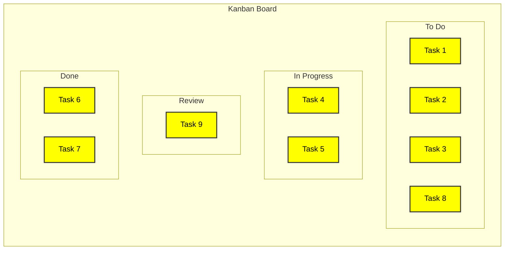

# Kanban Board

The Kanban Board serves as a potent tool in adaptive project approaches, offering a visual snapshot of work in different stages of progress. It essentially functions as a dynamic interface where the project team can interact with tasks, usually represented as cards, within different columns that signify different workflow stages. While a product backlog gives you a prioritized list of all potential work items, the Kanban Board offers real-time insight into what's currently being tackled.

## Example



## Components of a Kanban Board

- **Columns**: Each column corresponds to a phase in the workflow, such as 'To Do,' 'In Progress,' and 'Done.'
- **Cards**: These are the work items, often user stories or tasks, pulled from the product backlog.
- **Work in Progress (WIP) Limits**: Each column can have a numerical cap on how many items it can hold, which is known as the WIP limit.

## Work in Progress Limits

The concept of WIP limits is crucial. By setting a maximum number of items that can reside in a particular workflow step, the team ensures it doesn't bite off more than it can chew. The WIP limits serve as a self-imposed constraint that facilitates a smoother flow of work and helps in identifying bottlenecks early.

## Pull System

The Kanban system operates on a 'pull' mechanism. Team members 'pull' new tasks into their 'In Progress' column from the 'To Do' column based on the WIP limits and project priorities. They then move tasks to the 'Done' column upon completion, making room for new tasks to be pulled into the 'In Progress' column.

## Bottleneck Identification and Prioritization

One of the major advantages of using a Kanban Board is its ability to make bottlenecks visible. When items pile up in a particular column and exceed the WIP limits, it's a signal for the team to focus on resolving whatever is causing the delay. These insights are invaluable for prioritization decisions regarding both the product backlog and release plans.

## Adaptive and Iterative

Because of its visual nature and immediate representation of work status, the Kanban Board is particularly useful in agile and other adaptive methodologies. It provides the project team with the flexibility to adapt to changes quickly and align themselves with evolving business objectives and customer needs.

## Interface with Product Backlog

The Kanban Board and the product backlog are interrelated. The project team pulls items from the product backlog, usually in priority order, into the Kanban Board. As work progresses, completed items might be checked against the product backlog for validation and acceptance criteria.

A Kanban Board serves as a real-time communication tool, an information radiator, and a method for balancing the team's workload. Its utility extends beyond merely tracking tasks to providing actionable insights that feed into broader project management and strategic planning, especially in adaptive environments.

## Quiz

```quiz
Question: In the context of Kanban Boards, why are Work in Progress (WIP) Limits set for each column?
A: To prioritize tasks in the product backlog.
B: To restrict the number of tasks in a column, preventing overload and identifying bottlenecks.
C: To display completed tasks in the 'Done' column.
D: To determine which tasks to 'pull' from the 'To Do' column.
Answer: B
Explanation: WIP Limits are set to control the number of tasks in each workflow stage, preventing the team from taking on too much work at once and aiding in the early identification of bottlenecks.

Question: How does the 'pull' system in a Kanban Board function?
A: Team members add new tasks to the 'To Do' column as they arise.
B: Tasks are automatically moved to the 'Done' column upon completion.
C: Team members 'pull' tasks from the 'To Do' column to 'In Progress' based on WIP limits and priorities.
D: Tasks are assigned to team members by the project manager.
Answer: C
Explanation: In the 'pull' system of a Kanban Board, team members move tasks from 'To Do' to 'In Progress' based on the WIP limits and current priorities, ensuring an efficient workflow.

Question: What is a primary benefit of the visual nature of a Kanban Board in adaptive methodologies?
A: It allows for a static representation of the project plan.
B: It facilitates easy archiving of completed tasks.
C: It provides a dynamic view of work status, aiding quick adaptation to changes.
D: It serves to document the project's historical data.
Answer: C
Explanation: The visual aspect of a Kanban Board is crucial in adaptive methodologies as it provides a real-time, dynamic view of work status, enabling the team to quickly adapt to changes and align with evolving objectives.

Question: How does a Kanban Board interface with the product backlog?
A: It displays all the items in the product backlog in the 'To Do' column.
B: Tasks are pulled from the product backlog into the Kanban Board based on priority.
C: The product backlog is updated based on the status of tasks in the 'Done' column.
D: The product backlog is solely used for reference and not integrated with the Kanban Board.
Answer: B
Explanation: The Kanban Board interfaces with the product backlog by pulling tasks, usually based on their priority, from the backlog into the board. This ensures that the work on the board reflects current priorities and needs.

Question: What does the accumulation of tasks in a specific column of a Kanban Board typically indicate?
A: The team is efficiently managing their workload.
B: There is a bottleneck in the workflow at that stage.
C: The project is ahead of schedule.
D: The WIP limits for that column need to be increased.
Answer: B
Explanation: When tasks accumulate in a specific column of a Kanban Board, it usually indicates a bottleneck in the workflow at that stage, signaling the team to address and resolve the issue to maintain a smooth flow of work.
```
