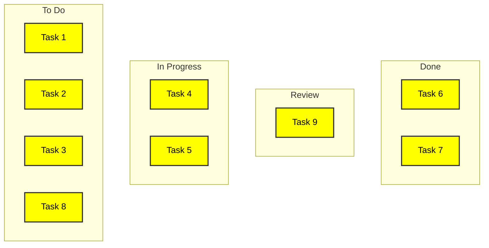

# Kanban Board

The Kanban Board serves as a potent tool in adaptive project approaches, offering a visual snapshot of work in different stages of progress. It essentially functions as a dynamic interface where the project team can interact with tasks, usually represented as cards, within different columns that signify different workflow stages. While a product backlog gives you a prioritized list of all potential work items, the Kanban Board offers real-time insight into what's currently being tackled.

### Example

### Components of a Kanban Board

- **Columns**: Each column corresponds to a phase in the workflow, such as 'To Do,' 'In Progress,' and 'Done.'
- **Cards**: These are the work items, often user stories or tasks, pulled from the product backlog.
- **Work in Progress (WIP) Limits**: Each column can have a numerical cap on how many items it can hold, which is known as the WIP limit.

### Work in Progress Limits

The concept of WIP limits is crucial. By setting a maximum number of items that can reside in a particular workflow step, the team ensures it doesn't bite off more than it can chew. The WIP limits serve as a self-imposed constraint that facilitates a smoother flow of work and helps in identifying bottlenecks early.

### Pull System

The Kanban system operates on a 'pull' mechanism. Team members 'pull' new tasks into their 'In Progress' column from the 'To Do' column based on the WIP limits and project priorities. They then move tasks to the 'Done' column upon completion, making room for new tasks to be pulled into the 'In Progress' column.

### Bottleneck Identification and Prioritization

One of the major advantages of using a Kanban Board is its ability to make bottlenecks visible. When items pile up in a particular column and exceed the WIP limits, it's a signal for the team to focus on resolving whatever is causing the delay. These insights are invaluable for prioritization decisions regarding both the product backlog and release plans.

### Adaptive and Iterative

Because of its visual nature and immediate representation of work status, the Kanban Board is particularly useful in agile and other adaptive methodologies. It provides the project team with the flexibility to adapt to changes quickly and align themselves with evolving business objectives and customer needs.

### Interface with Product Backlog

The Kanban Board and the product backlog are interrelated. The project team pulls items from the product backlog, usually in priority order, into the Kanban Board. As work progresses, completed items might be checked against the product backlog for validation and acceptance criteria.

A Kanban Board serves as a real-time communication tool, an information radiator, and a method for balancing the team's workload. Its utility extends beyond merely tracking tasks to providing actionable insights that feed into broader project management and strategic planning, especially in adaptive environments.
