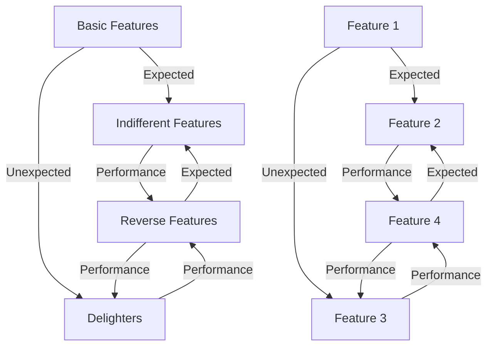

# Kano Analysis

Kano Analysis is a technique focused on understanding customer perceptions and preferences regarding various features of a product or service. This approach allows business analysts and product teams to evaluate and prioritize features based on their impact on customer satisfaction.

The technique uses a two-dimensional grid to plot features, with the vertical axis indicating the level of customer satisfaction and the horizontal axis showing how well the feature meets the customer's needs or expectations.

To gather the necessary data for plotting, a Kano survey is usually administered to customers. This helps in understanding their perception of each feature's importance and satisfaction level.

Features are categorized into one of five distinct categories based on customer viewpoints:

1. **Basic Features**: These are the 'must-haves' and are considered foundational for any product or service. While their presence doesn't significantly boost customer satisfaction, their absence can cause severe dissatisfaction.

2. **Performance Features**: These features are directly correlated with the level of customer satisfaction. The better these features are executed, the more satisfied the customers. Customers actively think about and compare these features when evaluating different products or services.

3. **Delighters**: These are unexpected features that can significantly increase customer satisfaction. Often referred to as the 'wow' factor, these features are not necessarily missed if absent but can substantially improve the product's overall perception when present.

4. **Indifferent Features**: These features neither add to nor detract from customer satisfaction. They are often along the horizontal axis of the Kano model as they don't significantly influence the customer's perception of the product.

5. **Reverse Features**: These are features that can actually reduce customer satisfaction if present but increase satisfaction if absent. This usually happens when the feature contradicts what the customer wants or expects from the product.

Over time, customer perceptions of features can shift. What was once a Delighter may become a mere Performance feature as competitors catch up, or customer expectations evolve.

Kano Analysis is valuable for product development, feature prioritization, and strategic planning. It provides actionable insights for aligning a product's feature set with customer needs and expectations, helping in informed decision-making.

## Example



## Quiz

```quiz
Question: What is the primary purpose of Kano Analysis in product development?
A: To determine the financial budget for each feature
B: To understand customer perceptions of different features
C: To create a legal framework for customer agreements and contracts
D: To track the performance of the sales team
Answer: B
Explanation: Kano Analysis is primarily used in product development to understand customer perceptions and preferences regarding various features of a product or service, allowing for effective evaluation and prioritization of these features.

Question: In Kano Analysis, what are "Basic Features" characterized by?
A: They significantly increase customer satisfaction when present but aren't missed if absent
B: They are considered essential but don't boost satisfaction significantly
C: They are unexpected and provide a 'wow' factor
D: They actively reduce customer satisfaction when present
Answer: B
Explanation: "Basic Features" in Kano Analysis are considered foundational and essential for any product or service. While their presence doesn't significantly boost customer satisfaction, their absence can cause severe dissatisfaction.

Question: How are "Delighters" defined in Kano Analysis?
A: Features that are essential and increase satisfaction proportionally when present
B: Features that significantly increase satisfaction if present but aren't missed if absent
C: Features that neither add to nor detract from customer satisfaction when present
D: Features that reduce satisfaction if present but increase satisfaction if absent
Answer: B
Explanation: "Delighters" in Kano Analysis are unexpected features that can significantly increase customer satisfaction if present. They offer a 'wow' factor, but they are not necessarily missed if absent.

Question: What insight does Kano Analysis provide for feature prioritization in product development?
A: It focuses on the aesthetic aspects of the product or service
B: It helps align product features with customer needs and expectations
C: It dictates the exact technical specifications required
D: It serves as the primary basis for legal documentation and contracts
Answer: B
Explanation: Kano Analysis provides valuable insights for feature prioritization in product development by helping to align the product's feature set with customer needs and expectations, aiding in informed decision-making.

Question: What happens to customer perceptions of features over time according to Kano Analysis?
A: They remain constant and unchanging throughout the product lifecycle
B: They can shift, turning Delighters into basic or performance features
C: They become less relevant with technological advancements and innovations
D: They are always aligned with the initial market research findings
Answer: B
Explanation: According to Kano Analysis, customer perceptions of features can shift over time. Features that were once considered Delighters may become basic or performance features as customer expectations evolve or as competitors catch up.

```
