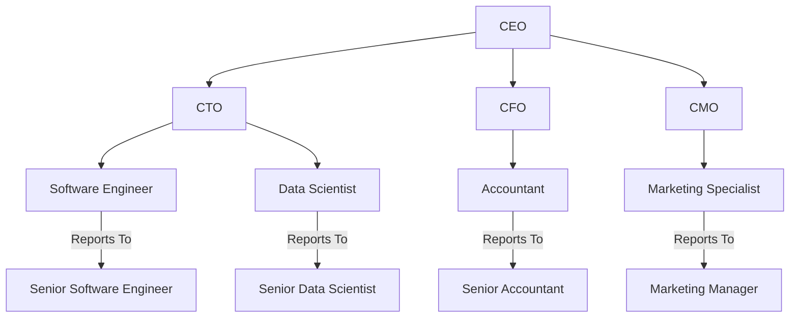

# Organizational Chart

Organizational charts serve as a crucial tool for Business Analysts (BAs) in stakeholder identification and analysis. These charts visually depict the hierarchy and reporting structure within an organization, or a segment of it, and help BAs discover stakeholder groups or individuals who could be impacted by, or have an impact on, the proposed solution.

Two approaches can be used for leveraging organizational charts in business analysis:

1. **Existing Organizational Charts**: If available, these can serve as a starting point. Existing charts are usually reliable for initial identification of key stakeholders or groups within the organization.
2. **New Organizational Charts**: In cases where existing charts are either inaccessible or outdated, BAs might need to build new ones. This is typically accomplished through discussions with representatives or individuals being modeled, often managers of the respective departments.

The level of detail in an organizational chart is contingent on multiple factors, including:

- **Scope and Size of the Organization**: Larger organizations may necessitate more complex charts with layers of hierarchy.
- **Purpose of the Analysis**: If the BA's goal is solely to identify groups impacted by the solution, a role-based chart that does not drill down to individual stakeholders may suffice.

It's crucial for BAs to recognize the variations in roles across the organization. These roles could differ based on geographical locations, types of customers supported, or even sub-groups within the same department. When such variations are identified, they should be reflected in the stakeholder register and can also inform persona analysis for a more nuanced understanding of stakeholder roles.

The organizational chart serves to ensure comprehensive stakeholder identification. Overlooking even a single role type could lead to a solution that fails to meet the needs of a significant number of customers, potentially impacting the success of the project. Therefore, continual refinement of organizational charts is essential, particularly as the BA gains more insights during the stakeholder analysis phase.

## Example



## Quiz

```quiz
Question: As a Business Analyst, you are using an organizational chart to identify stakeholders for a new IT project. What should you primarily focus on in this chart?
A: The specific technical skills of individuals in the IT department.
B: The hierarchy and reporting structure, particularly within departments related to the project.
C: The personal preferences and interests of the CEO and other top executives.
D: The financial and budgetary responsibilities of the CFO and the finance department.
Answer: B
Explanation: When using an organizational chart for stakeholder identification in an IT project, the primary focus should be on the hierarchy and reporting structure, especially within departments that are related to the project.

Question: In a scenario where the existing organizational chart is outdated, what approach should a Business Analyst take?
A: Rely solely on the outdated chart for simplicity.
B: Build a new organizational chart through discussions with department managers.
C: Focus only on the top management level to save time.
D: Avoid using organizational charts altogether and rely on informal networks.
Answer: B
Explanation: If existing organizational charts are outdated, the Business Analyst should build new ones through discussions with department managers or representatives to ensure accurate stakeholder identification.

Question: Why is it important for Business Analysts to continually refine organizational charts during the stakeholder analysis phase?
A: To accommodate changes in the organization's financial status.
B: To reflect the evolving understanding and identification of stakeholder roles and groups.
C: To focus on the technological advancements within the organization.
D: To prioritize stakeholders based on their authority in the organization.
Answer: B
Explanation: Continual refinement of organizational charts is important to reflect the evolving understanding and identification of stakeholder roles and groups, ensuring comprehensive stakeholder identification.

Question: When considering the scope and size of an organization, how does this factor influence the level of detail in an organizational chart used for business analysis?
A: Larger organizations require simpler charts with fewer details.
B: The scope and size of the organization have no impact on the level of detail in the chart.
C: Larger organizations may necessitate more complex charts with layers of hierarchy.
D: All organizations should use a standard template regardless of their size.
Answer: C
Explanation: In larger organizations, the organizational chart may need to be more complex with layers of hierarchy to accurately represent the structure and aid in stakeholder identification.

Question: If a Business Analyst's goal is to identify groups impacted by a proposed solution, what type of organizational chart would be most appropriate?
A: A detailed chart with information on individual stakeholders' personal interests.
B: A role-based chart that does not drill down to individual stakeholders.
C: A chart focused only on the top management hierarchy.
D: A chart that includes external stakeholders like customers and suppliers.
Answer: B
Explanation: If the goal is to identify groups impacted by the solution, a role-based organizational chart that does not drill down to individual stakeholders may suffice.

```
