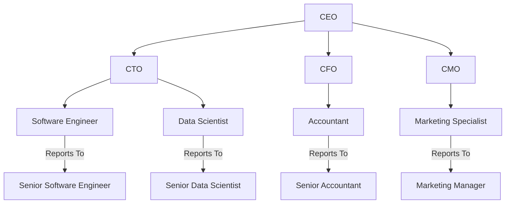

# Organizational Chart

Organizational charts serve as a crucial tool for Business Analysts (BAs) in stakeholder identification and analysis. These charts visually depict the hierarchy and reporting structure within an organization, or a segment of it, and help BAs discover stakeholder groups or individuals who could be impacted by, or have an impact on, the proposed solution.

Two approaches can be used for leveraging organizational charts in business analysis:

1. **Existing Organizational Charts**: If available, these can serve as a starting point. Existing charts are usually reliable for initial identification of key stakeholders or groups within the organization.
2. **New Organizational Charts**: In cases where existing charts are either inaccessible or outdated, BAs might need to build new ones. This is typically accomplished through discussions with representatives or individuals being modeled, often managers of the respective departments.

The level of detail in an organizational chart is contingent on multiple factors, including:

- **Scope and Size of the Organization**: Larger organizations may necessitate more complex charts with layers of hierarchy.
- **Purpose of the Analysis**: If the BA's goal is solely to identify groups impacted by the solution, a role-based chart that does not drill down to individual stakeholders may suffice.

It's crucial for BAs to recognize the variations in roles across the organization. These roles could differ based on geographical locations, types of customers supported, or even sub-groups within the same department. When such variations are identified, they should be reflected in the stakeholder register and can also inform persona analysis for a more nuanced understanding of stakeholder roles.

The organizational chart serves to ensure comprehensive stakeholder identification. Overlooking even a single role type could lead to a solution that fails to meet the needs of a significant number of customers, potentially impacting the success of the project. Therefore, continual refinement of organizational charts is essential, particularly as the BA gains more insights during the stakeholder analysis phase.

### Example

