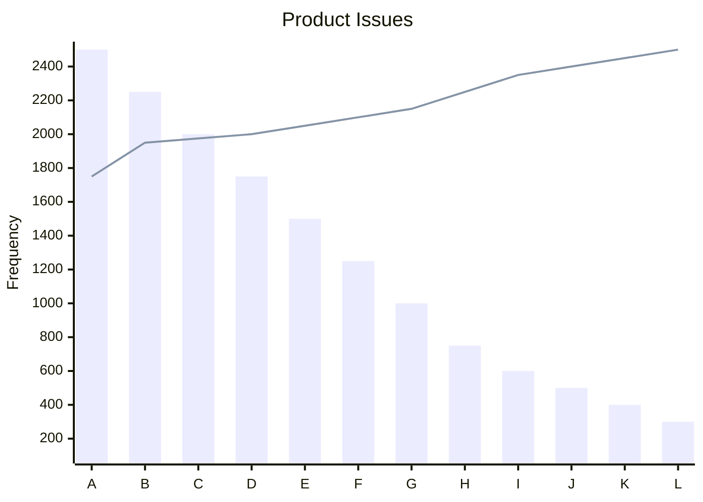

# Pareto Diagrams

A Pareto Diagram is a specialized type of histogram used primarily for prioritizing and focusing efforts. The diagram takes its name from the Pareto Principle, commonly known as the 80/20 rule, which states that approximately 80% of the problems or effects come from 20% of the causes. This diagram serves as an effective tool for root cause analysis, enabling teams to emphasize the most significant factors within a data set.

The vertical axis of the Pareto Diagram is typically used for depicting categories like frequency, cost, time, or other units that are significant to the project. These could represent the frequency of different types of issues arising, the financial cost tied to different problems, or other units that are crucial for decision-making.

The horizontal axis displays the specific categories that are being measured. These could be types of problems, cause categories, or any other classification that's under analysis. Data are arranged in descending order on the vertical axis, drawing attention to the most pressing issues or significant causes.

By examining a Pareto Diagram, a team can instantly identify which problems, causes, or costs require immediate attention, making it easier to allocate resources efficiently. Since the data points are displayed in descending order of importance, it allows for an intuitive understanding of priority issues, and the diagram can often reveal that a significant percentage of problems are caused by a small number of root causes. This is in alignment with the 80/20 principle, which suggests that focusing on these few root causes can result in a large-scale improvement.

Pareto Diagrams are versatile and can be tailored to depict various kinds of information depending on the project needs. Whether you're trying to identify the frequency of software bugs, the common reasons for project delays, or categories incurring the highest costs, a Pareto Diagram provides a visual tool for quick analysis and decision-making.

The process of creating and interpreting these diagrams is known as Pareto Analysis. This technique is particularly useful in problem-solving scenarios where resources are limited, and the team needs to focus on actions that will provide the maximum benefit. Therefore, Pareto Diagrams serve not just as descriptive statistics tools, but also as devices for strategic prioritization and resource allocation.



## Quiz

```quiz
Question: What is the primary purpose of a Pareto Diagram in problem-solving?
A: To create detailed financial forecasts for future projects.
B: To prioritize and focus efforts by identifying significant factors.
C: For organizing and scheduling team meetings and activities.
D: To track employee performance metrics and evaluations.
Answer: B
Explanation: A Pareto Diagram is used primarily for prioritizing and focusing efforts by identifying the most significant factors in a dataset.

Question: In a Pareto Diagram, what does the vertical axis typically represent?
A: The individual performance ratings of team members.
B: Categories like frequency, cost, time, or other significant units.
C: The geographic distribution of project resources.
D: The chronological timeline of the project development.
Answer: B
Explanation: The vertical axis of a Pareto Diagram typically depicts categories such as frequency, cost, time, or other units significant to the project.

Question: How are data points arranged in a Pareto Diagram and why?
A: Alphabetically, to enhance readability and organization.
B: Randomly, to encourage diverse viewpoints and analysis.
C: In descending order, to highlight the most pressing issues.
D: Chronologically, to show the progression of project activities.
Answer: C
Explanation: Data points in a Pareto Diagram are arranged in descending order on the vertical axis to draw attention to the most pressing issues or significant causes.

Question: What principle underlies the Pareto Diagram and its effectiveness?
A: The principle of maximum resource allocation.
B: The Pareto Principle or 80/20 rule.
C: The principle of equitable distribution.
D: The principle of chronological sequencing.
Answer: B
Explanation: The Pareto Diagram is based on the Pareto Principle or the 80/20 rule, which states that approximately 80% of the problems come from 20% of the causes.

Question: What aspect of project information can be tailored in a Pareto Diagram?
A: The color scheme and design aesthetics of the diagram.
B: The type of information depicted, like software bugs or project delays.
C: The personal preferences of team members regarding data presentation.
D: The choice of language and terminology used in the diagram.
Answer: B
Explanation: A Pareto Diagram can be tailored to depict various kinds of information depending on the project needs, such as the frequency of software bugs or common reasons for project delays.

```

```

```
