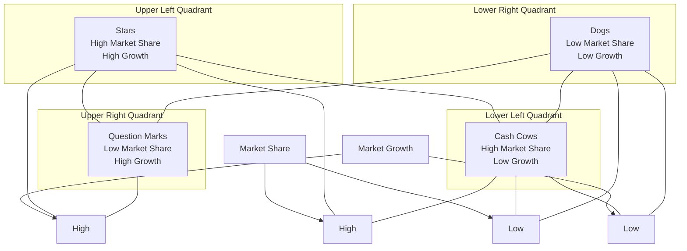

# Product Portfolio Matrix

## Product Portfolio Matrix in Business Analysis Context

A Product Portfolio Matrix, commonly known as a growth-share matrix, is a strategic business analysis tool designed for the qualitative assessment of an organization's range of products or product lines. This matrix employs a two-dimensional quadrant diagram to provide insights into the performance and potential of products in the marketplace.

## Key Axes: Market Growth and Market Share

The matrix is constructed using two axes:

- **Market Growth**: This axis ranges from low to high and represents the growth rate of the market for a particular product. It serves as an indicator of market attractiveness and demand levels.
- **Market Share**: This axis also ranges from low to high and signifies the percentage of the market controlled by the organization's product. It can be seen as a measure of competitive strength.

## Quadrants and Interpretation

The matrix is divided into four quadrants, each offering specific insights:

1. **Upper Left Quadrant**: Products positioned here have a high market share in a rapidly growing market. These are generally seen as 'stars' because they offer the most significant benefits to the organization. They are high performers that require focus and investment to maintain or grow their dominant position.

2. **Upper Right Quadrant**: Products in this quadrant have a low market share but are in a high growth market. Often called 'question marks' or 'problem children,' these products possess good potential but need strategic investments to increase market share.

3. **Lower Left Quadrant**: Products in this area have a high market share but are in a market with low growth. These are usually termed 'cash cows' and are considered dependable sources of income. Investments in these products are usually low, and they are often used to fund 'stars' and 'question marks.'

4. **Lower Right Quadrant**: Products here have both low market share and low growth rates. Often termed 'dogs,' these products are low performers and are candidates for divestment or repositioning.

## Strategic Decision-Making

The matrix aids in strategic decision-making by providing a visual representation of where each product stands concerning market growth and share. It allows organizations to allocate resources more efficiently, balance their product portfolio, and align their product strategies with corporate objectives. For example, the matrix can inform decisions on whether to invest in market penetration, market development, product development, or divestment.

## Summary

The Product Portfolio Matrix serves as a powerful tool for evaluating the overall health and strategic fit of an organization's product portfolio. By categorizing products into one of four quadrants, it enables decision-makers to quickly assess performance, potential, and investment needs, thereby guiding both operational and strategic initiatives.



## Quiz

```quiz
Question: What is the primary purpose of using a Product Portfolio Matrix in business analysis?
A: To provide a detailed financial analysis of each product.
B: To qualitatively assess the range of products in terms of market growth and market share.
C: It is exclusively used for human resource allocation.
D: To develop technical specifications for new products.
Answer: B
Explanation: The primary purpose of the Product Portfolio Matrix is to qualitatively assess an organization's range of products or product lines based on market growth and market share, aiding in strategic decision-making.

Question: How does the 'Upper Left Quadrant' in the Product Portfolio Matrix signify a product's market position?
A: It indicates products with low market share in a rapidly declining market.
B: Products in this quadrant have high market share in a high growth market, indicating they are 'stars' with significant benefits.
C: The quadrant represents products with high market share in a low growth market.
D: It signifies products that are new to the market with untested potential.
Answer: B
Explanation: The 'Upper Left Quadrant' of the Product Portfolio Matrix represents products that have a high market share in a rapidly growing market. These products are considered 'stars' and are crucial for the organization’s growth and profit.

Question: What strategy might be recommended for a product in the 'Lower Right Quadrant' of the matrix?
A: Significant investment for market expansion.
B: Maintaining the status quo with minimal changes.
C: Consideration for divestment or repositioning due to low performance.
D: Aggressive marketing and development as they are 'stars.'
Answer: C
Explanation: Products in the 'Lower Right Quadrant' (low market share, low growth) are often termed 'dogs.' They are low performers and the matrix suggests they might be candidates for divestment or repositioning.

Question: Why are products in the 'Lower Left Quadrant' referred to as 'cash cows'?
A: They require high investment for market growth.
B: These are new products with untested market potential.
C: They are dependable sources of income with low growth but high market share, requiring minimal investment.
D: They have low market share and are considered non-essential to the business.
Answer: C
Explanation: Products in the 'Lower Left Quadrant' are termed 'cash cows' because they have a high market share in a low growth market, making them dependable sources of steady income with typically low investment needs.

Question: In the context of the Product Portfolio Matrix, what are 'question marks' or 'problem children'?
A: Products with high market share and high market growth.
B: Products in a low growth market with high market share.
C: Products with low market share in a high growth market, indicating potential but requiring strategic investment.
D: Products with both low market share and low growth rates.
Answer: C
Explanation: 'Question marks' or 'problem children' refer to products that have a low market share in a high growth market. They show potential but require strategic investments to increase their market share.
```
