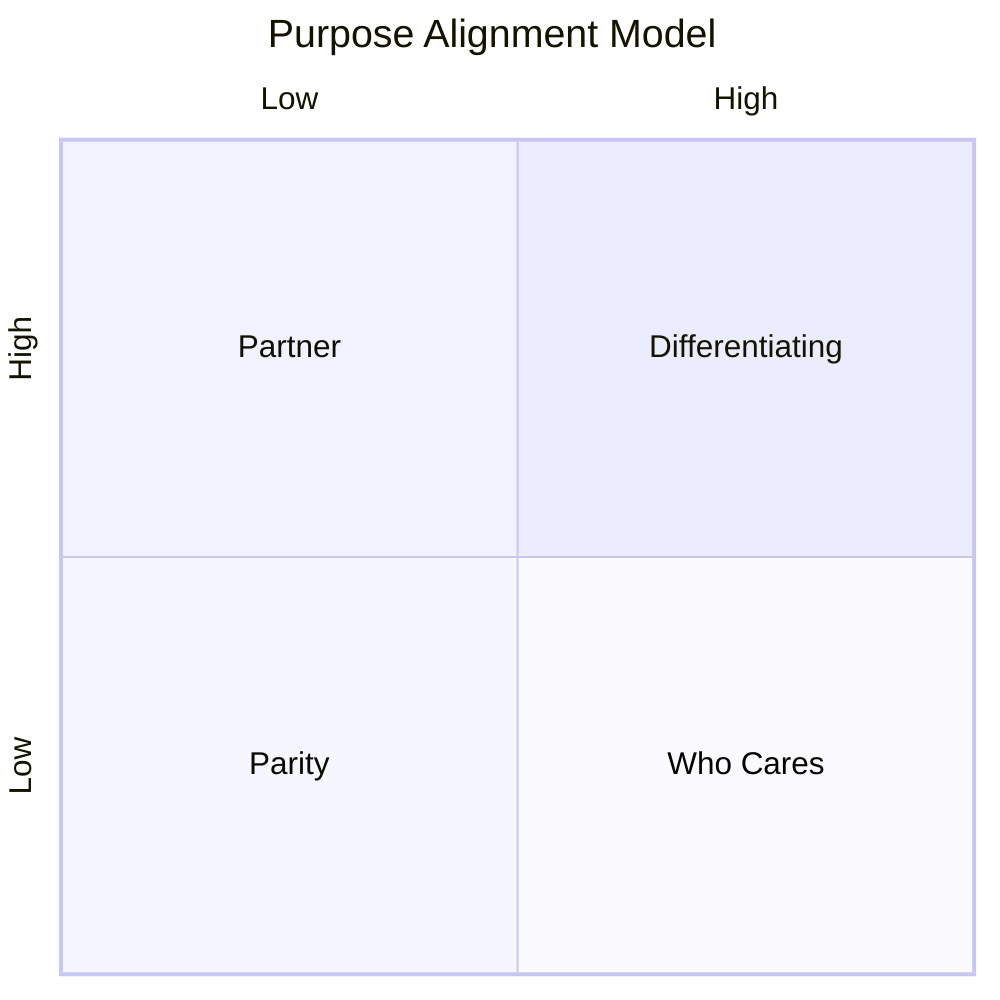

# Purpose Alignment Model

The Purpose Alignment Model is a strategic tool used for making informed decisions concerning product features or business options by aligning them with the organization's overarching business purposes. This technique is often used at a strategic level to determine which options are most aligned with the organization's goals and objectives. It facilitates discussions within the product team and other stakeholders to evaluate the value proposition of each feature or option, thereby serving as an input for prioritization activities.

The model employs a quadrant matrix for categorizing features based on two primary dimensions: "Criticality" and "Market Differentiation."

- **Criticality**: This dimension assesses how mission-critical a feature or option is for the organization. Features that are deemed highly critical may be essential for regulatory compliance or the basic operations of the business.
- **Market Differentiation**: This assesses the potential for a feature or option to provide a competitive advantage in the market. Features that are market differentiators can significantly impact market share, increase sales, or offer a unique selling proposition against competitors.

The Purpose Alignment Model categorizes product features into four main types:

1. **Differentiating**: Features in this quadrant are both mission-critical and offer high market differentiation. Investment in such features is imperative for maintaining a competitive edge. Organizations focusing on these areas are often seen as innovators. It is crucial to continually invest in and develop differentiating features to stay ahead in the market.

2. **Parity**: Features here are mission-critical but do not offer market differentiation. They keep the organization at par with competitors but don't provide a competitive advantage. While these features may be essential for business operations, they are not areas where the company should aim to differentiate itself.

3. **Partner**: Features in this category are not mission-critical but offer potential market differentiation. Organizations typically won't invest internal resources in developing these features but might seek external partnerships to acquire them. Such features, if provided by a partner, could enhance the organization's market position.

4. **Who Cares**: Features in this category are neither mission-critical nor offer market differentiation. These features usually do not warrant investment and are often not developed.

By using the Purpose Alignment Model, organizations can make more informed decisions about where to invest their resources. It helps in aligning the product strategy with the business strategy by facilitating a shared understanding within the product team about the value and importance of each feature. This shared understanding, in turn, can drive more effective prioritization and decision-making processes.

### Example

