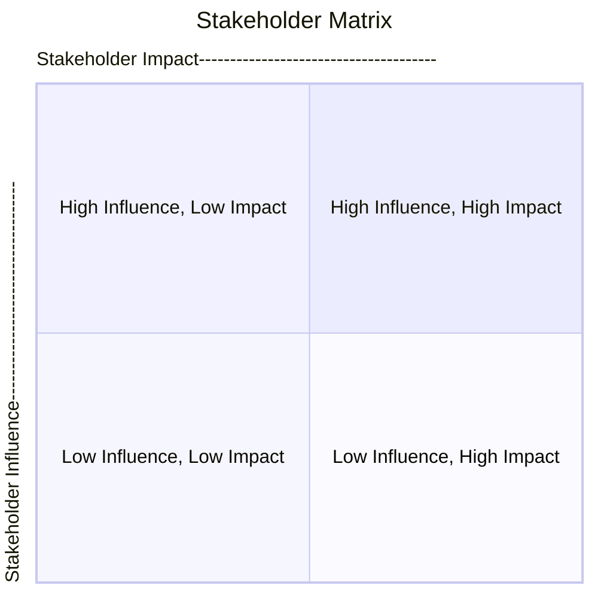

# Stakeholder Matrix

The Stakeholder Matrix is a tool used in business analysis for stakeholder analysis and engagement. It helps in categorizing stakeholders based on two variables commonly chosen as 'Influence' and 'Impact.' This technique is beneficial in identifying the nature of the stakeholder's relationship with the project and what kind of attention or management approach they require.

### Objective

The primary goal of a Stakeholder Matrix is to prioritize stakeholders based on their level of influence on the project and the degree to which they are impacted by the project. This allows the business analyst to develop targeted stakeholder engagement strategies, decide on the level and frequency of communication, and allocate resources more efficiently.

### Structure

The matrix consists of a quadrant, divided by X and Y axes. The X-axis commonly represents 'Influence,' and the Y-axis represents 'Impact.' Stakeholders are placed in one of the four quadrants, based on these variables:

1. **High Influence/Low Impact**: Stakeholders in this quadrant have a high ability to affect the project but are not significantly impacted by it. These are often senior leaders or decision-makers who may act as champions for the project. Their buy-in is essential, and regular communication is necessary to leverage their support.

2. **High Influence/High Impact**: These stakeholders have both a significant influence over the project and are highly impacted by it. They are crucial for the business analysis and should be closely engaged throughout the project. A lot of the business analysis effort should be directed towards this group to ensure a successful outcome.

3. **Low Influence/Low Impact**: These stakeholders have neither significant influence nor impact. While they should not be ignored, they may be less involved in the day-to-day activities of the business analysis process. Their requirements might be considered later in the project or might not be implemented at all.

4. **Low Influence/High Impact**: These stakeholders may not have a high level of influence but are significantly impacted by the project's outcome. They often have essential requirements that need to be considered and should be actively engaged, especially during requirement elicitation activities.

### Steps for Creation

1. **Identify Variables**: Choose the X and Y-axis variables (commonly Influence and Impact).

2. **List Stakeholders**: Enumerate all the stakeholders who are part of the project or who have an interest in the project.

3. **Assess Influence and Impact**: Evaluate each stakeholder based on the chosen variables.

4. **Place in Quadrant**: Place each stakeholder in the appropriate quadrant based on their levels of influence and impact.

5. **Develop Engagement Strategies**: Develop specific stakeholder engagement strategies based on the categorization.

### Advantages

- Helps in prioritizing stakeholders for effective communication.
- Provides insights for resource allocation during business analysis activities.
- Assists in creating targeted engagement strategies.

### Limitations

- The categorization may be subjective and may require periodic reassessment.
- Stakeholders may fall near the border of two quadrants, making classification challenging.

The Stakeholder Matrix is a strategic tool that, when employed effectively, can significantly aid the business analysis process by focusing efforts where they are most needed.

