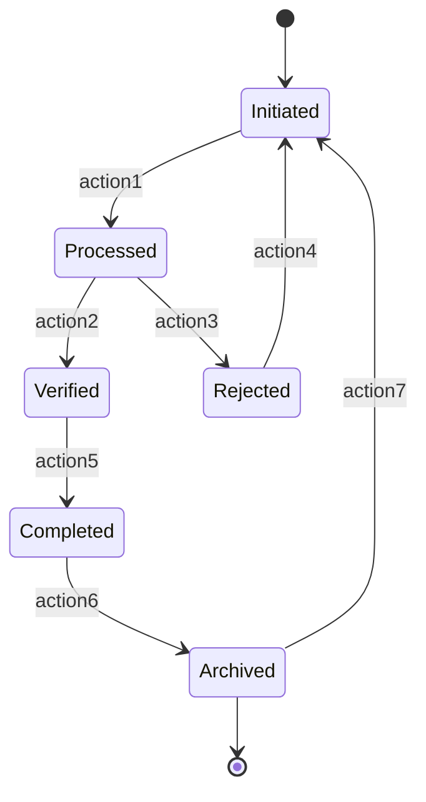

# State Table And State Diagram

State tables and state diagrams are data models employed in business analysis to illustrate the valid states an object can be in, along with permissible transitions between those states. These objects could range from business data items to any other piece of information that is crucial when dissecting a solution. Both models serve to clarify all possible states a single object can assume and the rules for transitioning between states.

## Characteristics of State Tables

A state table is generally organized in a tabular format where both rows and columns represent the possible states of an object. The intersections or cells of the table indicate the transition from the state denoted by the row to the state indicated by the column. If a transition is not permitted, the corresponding cell is generally marked with an "X," "N/A," or "no." Conversely, allowable transitions are marked with a "yes" or may contain a description of the event triggering the transition. State tables are particularly useful in ensuring completeness, as they compel the business analyst to systematically evaluate every potential transition between states.

## Example

|           | Initiated | Processed | Verified | Completed | Archived |
| --------- | --------- | --------- | -------- | --------- | -------- |
| Initiated | -         | ✓         | -        | -         | -        |
| Processed | -         | -         | ✓        | -         | -        |
| Verified  | -         | -         | -        | ✓         | -        |
| Completed | -         | -         | -        | -         | ✓        |
| Archived  | ✓         | -         | -        | -         | -        |

## Characteristics of State Diagrams

State diagrams, by contrast, offer a more visual representation. They employ ovals to represent states, and lines with arrows to indicate the transitions between states, sometimes labeled with the event that triggers the transition. Unlike state tables that show all possible transitions, including those that are not allowed, state diagrams present only the valid transitions, making it more straightforward for stakeholders to understand the flow. However, the visual nature of state diagrams could lead to a higher risk of missing out on some transitions.

## Example



## Use Cases

Both state tables and state diagrams are highly beneficial for solutions involving workflows, like an approval process. They are instrumental in uncovering business rules related to transitions between different states of an object. State tables offer the advantage of ensuring that all possible transitions are covered. In contrast, state diagrams are more effective in offering stakeholders a quick and intuitive understanding of valid transitions.

## Relationship to Requirements

While both state tables and state diagrams are standalone models, they are not always sufficient for capturing highly complex transition events. In such scenarios, additional details might be documented outside the model. They serve to confirm or identify gaps in data and processes that other models may have specified. They are frequently used to model business rules and do not necessarily require additional requirements statements for correct development and testing.

## Completeness and Visualization

In summary, state tables are more exhaustive in representing every possible transition, making them less prone to oversight. State diagrams, while easier to understand at a glance, might require extra diligence to ensure they are comprehensive.

By employing state tables and state diagrams meticulously, business analysts can specify the life cycle of an object in the solution space comprehensively and visually, thereby contributing to a more robust and reliable business solution.

## Quiz

```quiz
Question: What is the primary purpose of using State Tables and State Diagrams in business analysis?
A: To create a financial budget for the project.
B: To illustrate the valid states an object can assume and the transitions between those states.
C: They are used exclusively for technical coding in software development.
D: To record the meeting minutes of project discussions.
Answer: B
Explanation: The primary purpose of State Tables and State Diagrams in business analysis is to illustrate the valid states an object can be in and the permissible transitions between those states, aiding in understanding and documenting the object’s life cycle.

Question: How do State Tables ensure completeness in representing state transitions?
A: By only showing the final state of an object.
B: State Tables systematically evaluate every potential transition between states, including those that are not allowed.
C: They focus solely on the visual representation of states without detailing transitions.
D: State Tables are used to document stakeholder information.
Answer: B
Explanation: State Tables ensure completeness in representing state transitions by systematically evaluating and documenting every potential transition between states, including those that are not permitted, thereby reducing the risk of overlooking possible transitions.

Question: What advantage do State Diagrams have over State Tables?
A: State Diagrams provide a more exhaustive representation of transitions.
B: They offer a visual representation, making it easier for stakeholders to understand the flow of state transitions.
C: State Diagrams are used exclusively for documenting non-functional requirements.
D: They are less detailed and thus quicker to create.
Answer: B
Explanation: State Diagrams have the advantage of offering a more visual and intuitive representation of valid state transitions, which makes it easier for stakeholders to understand the flow and dynamics of state changes.

Question: In what scenario might State Tables and State Diagrams be particularly useful?
A: For designing the physical layout of office spaces.
B: In scenarios involving workflows, like an approval process, where understanding state transitions is crucial.
C: They are only useful in the final stages of project deployment.
D: State Tables and State Diagrams are primarily used for social media marketing strategies.
Answer: B
Explanation: State Tables and State Diagrams are particularly useful in solutions involving workflows, such as approval processes, where it's crucial to understand and document the transitions between different states of an object.

Question: How should State Tables and State Diagrams be used in relation to requirements?
A: They should be ignored in the requirements gathering process.
B: These models confirm or identify gaps in data and processes, often used to model business rules, and can stand alone without additional requirements statements.
C: They are used exclusively for capturing stakeholder contact details.
D: State Tables and State Diagrams are only relevant for legal documentation purposes.
Answer: B
Explanation: State Tables and State Diagrams are used to confirm or identify gaps in data and processes that other models may have specified. They are often employed to model business rules and can often stand alone without requiring additional requirements statements for correct development and testing.
```
