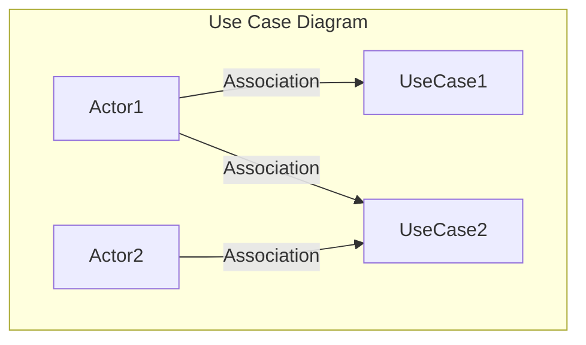

# Use Case Diagram

Use Case Diagrams are graphical depictions that illustrate the scope of use cases within a solution. These diagrams serve as a pivotal scope model in the landscape of business analysis. Below, we will thoroughly explore the various facets of Use Case Diagrams, including their construction, components, and utility across various stages of a portfolio, program, or project.

## Constituent Elements

### Ovals and Use Cases

In a Use Case Diagram, each use case is symbolized by an oval, inside which the name of the use case is inscribed. These ovals are pivotal in outlining the functionality that is in scope for the solution.

### Actors

Actors are represented as stick figures in the diagram. These actors can be individuals, roles, or other systems that interact with the use cases.

### Straight Lines and Associations

Straight lines, also known as associations, connect actors to the use cases they interact with. Importantly, these associations are not indicative of the flow of information; rather, they merely denote that a particular actor is associated with a specific use case.

## Timing and Lifecycle

Creation of Use Case Diagrams usually occurs early within the lifecycle of a portfolio, program, or project. However, as project needs change or evolve, these diagrams are subject to updates, especially when use cases are modified, added, or removed based on prioritization and scope adjustments.

## Example



## Utility and Applications

### Summarizing Scope

One of the primary usages of Use Case Diagrams is to summarize the scope of a solution. This enables stakeholders to quickly discern the key features or use cases that are in scope and will be implemented.

### Stakeholder Interaction

The diagram illustrates which stakeholders (represented as actors) will directly interact with the system, thereby making it a valuable tool for managing stakeholder expectations.

### Interface Planning

Use Case Diagrams offer insights into the interfaces that must be developed between the system and the actors. By visualizing these interfaces, the diagram aids in comprehensive planning and design.

### Out-of-Scope Indicators

The diagram can also serve to indicate use cases that are considered out of scope. This is particularly useful for setting boundaries and managing stakeholder expectations.

## Relationship to Requirements

Although Use Case Diagrams are not a direct representation of requirements, they play a significant role in organizing requirements. They facilitate the planning and tracking of project progress and serve as an organizing framework for business analysis efforts or for structuring a requirements document.

## Conclusion

In summary, Use Case Diagrams are instrumental in providing a visual synopsis of the scope of a solution. They contribute to a broad array of project objectives including stakeholder management, interface planning, and requirements organization. Given their versatile applications and vital role in shaping and communicating the scope of a project, Use Case Diagrams are an indispensable tool in the business analysis toolbox.

## Quiz

```quiz
Question: What is the primary purpose of Use Case Diagrams in business analysis?
A: To provide a detailed financial budget for the project.
B: To graphically depict the scope of use cases within a solution, illustrating the functionality and actor interactions.
C: They are used solely for documenting the technical architecture of a system.
D: To record the personal data of project stakeholders.
Answer: B
Explanation: Use Case Diagrams are used in business analysis primarily to graphically depict the scope of use cases within a solution. They illustrate the functionality that is in scope and how different actors interact with these use cases, providing a clear visual summary of the solution's scope.

Question: How are actors represented in a Use Case Diagram?
A: As detailed textual descriptions of each stakeholder's role.
B: Actors are represented as stick figures, symbolizing individuals, roles, or other systems that interact with the use cases.
C: Actors are not represented in Use Case Diagrams.
D: They are represented as circles.
Answer: B
Explanation: In Use Case Diagrams, actors are represented as stick figures. These actors can be individuals, roles, or other systems that interact with the use cases in the diagram, illustrating the interfaces between the system and its users.

Question: What does an association in a Use Case Diagram indicate?
A: It indicates the flow of information between actors and use cases.
B: Associations, represented as straight lines, denote that an actor is involved with a particular use case but do not indicate the flow of information.
C: Associations show the financial relationship between actors and use cases.
D: They indicate the technical specifications of the use cases.
Answer: B
Explanation: In Use Case Diagrams, associations are represented by straight lines connecting actors to use cases. These lines indicate that an actor is associated with a specific use case but do not show the flow of information.

Question: What role do Use Case Diagrams play in stakeholder management?
A: They are irrelevant in stakeholder management.
B: Use Case Diagrams are valuable for managing stakeholder expectations by illustrating which stakeholders will interact with the system.
C: These diagrams are used only for resolving stakeholder conflicts.
D: They are utilized solely for stakeholder financial planning.
Answer: B
Explanation: Use Case Diagrams play a significant role in stakeholder management. They illustrate which stakeholders (represented as actors) will directly interact with the system, thereby aiding in managing expectations and understanding stakeholder involvement.

Question: How do Use Case Diagrams contribute to interface planning?
A: By focusing on the aesthetic design of the interface.
B: They offer insights into the interfaces that need to be developed between the system and actors, aiding in planning and design.
C: Use Case Diagrams are not used for interface planning.
D: They only contribute to the planning of physical interfaces.
Answer: B
Explanation: Use Case Diagrams contribute to interface planning by visually representing the interactions between the system and its actors. This visualization aids in identifying and planning the interfaces that must be developed, ensuring comprehensive planning and design.
```
