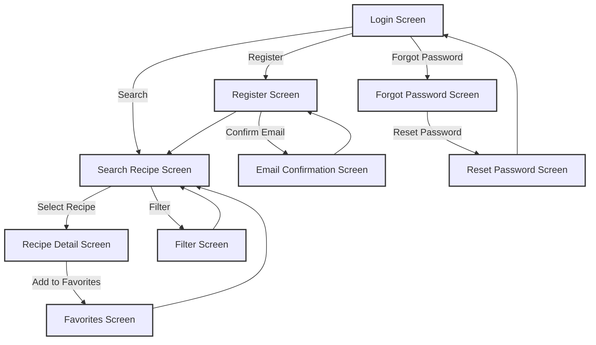

# User Interface Flow

User Interface Flow is an interface model specifically designed to illustrate the interactions between the user and the system via its user interface. This model is primarily concerned with providing a visual representation of how different user interfaces, commonly expressed as screens, are navigated. Each box in the user interface flow diagram represents a unique screen that a user would interact with, and the lines between these boxes illustrate the pathways or flows that are permissible between these screens. These flows are often activated by triggers such as buttons, links, or specific user actions.

The model's key utility is to add another layer of detail after the development of process flows and use cases. It serves as a navigational map for the system's user interface, ensuring that the design is both sensible and effective for the end-user. Given that the user interface is often the most direct point of interaction between a user and a system, getting this flow correct is crucial for overall user experience and system usability.

## Usage

User Interface Flows are generally crafted during the solution definition stage. They are particularly helpful for mapping out all the screens requiring further detail and can serve as a valuable tool during elicitation sessions. By visually representing the transitions between different screens, these models help to facilitate discussions around the precise functionalities responsible for guiding the user from one screen to another. It's worth noting that this model is only applicable when a user interface is a part of the overall solution.

## Relationship to Requirements

Although a User Interface Flow is a visual model, it does not serve as a stand-alone entity for capturing individual requirements. Instead, it should be considered complementary to other requirements models. It can be directly traced back to more granular models such as Display-Action-Response models, process flows, and individual requirements. Through this integrative approach, User Interface Flows offer a cohesive view that aids in understanding how each requirement will manifest in the actual user interface. This facilitates more accurate planning and execution, ensuring that the final solution closely aligns with stakeholder needs and expectations.

## Example



## Quiz

```quiz
Question: What is the primary purpose of a User Interface Flow in business analysis?
A: To create a detailed budget for the project.
B: Visually depict navigation and interactions between UI screens.
C: It is used solely for documenting the technical architecture of the system.
D: To record the personal information of system users.
Answer: B
Explanation: The primary purpose of a User Interface Flow in business analysis is to provide a visual representation of how users navigate through the system's interface. It illustrates the pathways between different screens, activated by user actions like clicking buttons or links, thereby aiding in the understanding of user-system interaction.

Question: At what stage in the solution development process are User Interface Flows typically created?
A: After the project has been completed.
B: In the solution definition stage, map screens for detail and aid elicitation sessions.
C: They are only created at the start of the project before any other documentation.
D: User Interface Flows are never created; they are assumed.
Answer: B
Explanation: User Interface Flows are generally crafted during the solution definition stage of the project. They are used to map out and provide detail for all the screens in a system and are particularly useful in elicitation sessions, facilitating discussions around user-system interactions.

Question: How do User Interface Flows relate to other requirements models?
A: They replace the need for other requirements models.
B: UI Flows complement requirements models, showing how requirements appear in the UI.
C: There is no relation between User Interface Flows and other requirements models.
D: User Interface Flows only focus on financial requirements.
Answer: B
Explanation: User Interface Flows do not stand alone but complement other requirements models. They can be traced back to more detailed models such as Display-Action-Response models and process flows. This integrative approach provides a cohesive view that helps stakeholders understand how each requirement will be represented in the actual user interface.

Question: What aspect of a solution does a User Interface Flow model primarily focus on?
A: The financial aspects of the solution.
B: Focuses on the UI, especially screen navigation and interactions.
C: User Interface Flows focus exclusively on the backend processing of the system.
D: They are primarily concerned with the physical hardware of the system.
Answer: B
Explanation: A User Interface Flow model focuses primarily on the user interface aspect of a solution. It visually maps out the navigation and interactions between different screens within the system's user interface, illustrating the user's journey through the system.

Question: Why is the User Interface Flow crucial for overall user experience and system usability?
A: It is irrelevant for user experience and system usability.
B: Ensures sensible and effective UI design, impacting user interaction.
C: User Interface Flows are only used for aesthetic purposes.
D: They are crucial because they focus only on the technical specifications of the user interface.
Answer: B
Explanation: The User Interface Flow is crucial for overall user experience and system usability because it provides a visual map of how the user will navigate the system's interface. By ensuring that this flow is sensible and effective, the model directly impacts the ease and efficiency with which users can interact with the system, thereby enhancing user experience and usability.
```
