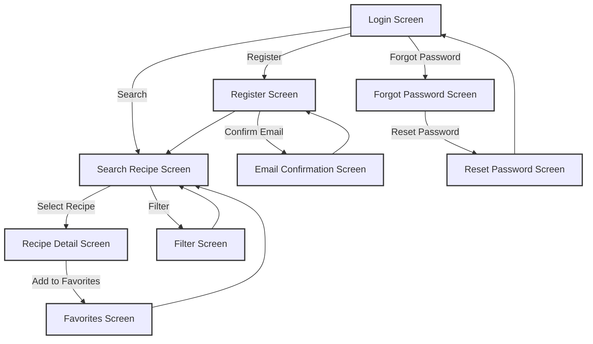

# User Interface Flow

User Interface Flow is an interface model specifically designed to illustrate the interactions between the user and the system via its user interface. This model is primarily concerned with providing a visual representation of how different user interfaces, commonly expressed as screens, are navigated. Each box in the user interface flow diagram represents a unique screen that a user would interact with, and the lines between these boxes illustrate the pathways or flows that are permissible between these screens. These flows are often activated by triggers such as buttons, links, or specific user actions.

The model's key utility is to add another layer of detail after the development of process flows and use cases. It serves as a navigational map for the system's user interface, ensuring that the design is both sensible and effective for the end-user. Given that the user interface is often the most direct point of interaction between a user and a system, getting this flow correct is crucial for overall user experience and system usability.

### Usage

User Interface Flows are generally crafted during the solution definition stage. They are particularly helpful for mapping out all the screens requiring further detail and can serve as a valuable tool during elicitation sessions. By visually representing the transitions between different screens, these models help to facilitate discussions around the precise functionalities responsible for guiding the user from one screen to another. It's worth noting that this model is only applicable when a user interface is a part of the overall solution.

### Relationship to Requirements

Although a User Interface Flow is a visual model, it does not serve as a stand-alone entity for capturing individual requirements. Instead, it should be considered complementary to other requirements models. It can be directly traced back to more granular models such as Display-Action-Response models, process flows, and individual requirements. Through this integrative approach, User Interface Flows offer a cohesive view that aids in understanding how each requirement will manifest in the actual user interface. This facilitates more accurate planning and execution, ensuring that the final solution closely aligns with stakeholder needs and expectations.

### Example

