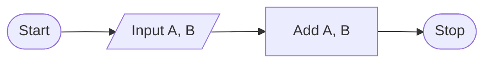

# Add

Write a function that returns the sum of two numbers.

## Example

For `param1 = 1` and `param2 = 2`, the output should be

```:no-line-numbers
add(param1, param2) = answer
```

## Chart



## Solution

::: code-group
<<< ./add.py [PYTHON]
<<< ./add.js [JAVASCRIPT]
<<< ./add.ts [TYPESCRIPT]
<<<./add.cs [C#]
:::
