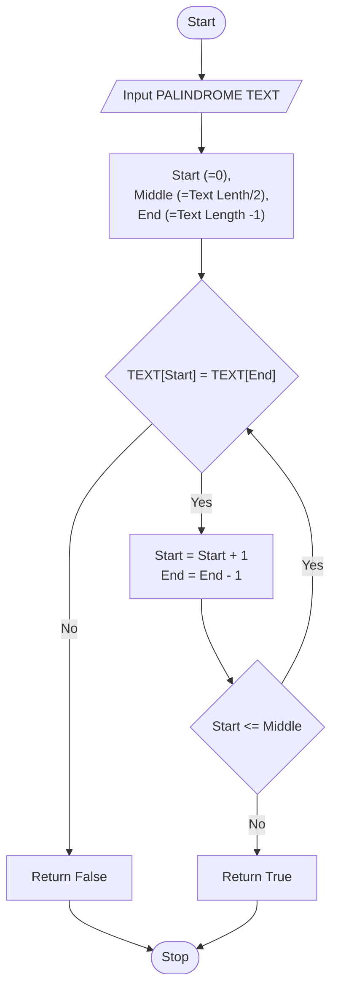

# Check Palindrome

Given the string, check if it is a [palindrome](keyword://palindrome).

## Example

- For `inputString = "aabaa"`, the output should be

  ```:no-line-numbers
  check_palindrome(inputString) = true
  ```

- For `inputString = "abac"`, the output should be

  ```:no-line-numbers
  check_palindrome(inputString) = false
  ```

- For `inputString = "a"`, the output should be

  ```:no-line-numbers
  check_palindrome(inputString) = true
  ```

## Chart



## Solution

::: code-group
<<< ./check-palindrome.py [PYTHON]
<<< ./check-palindrome.js [JAVASCRIPT]
<<< ./check-palindrome.ts [TYPESCRIPT]
<<< ./check-palindrome.cs [C#]
:::
