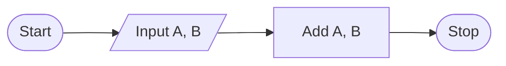

# Add

Write a function that returns the sum of two numbers.

## Example

For `param1 = 1` and `param2 = 2`, the output should be

```:no-line-numbers
add(param1, param2) = answer
```

## Chart



## Solution

:::: code-group
::: code-group-item PYTHON

@[code](./add.py)

:::

::: code-group-item JAVASCRIPT

@[code](./add.js)

:::

::: code-group-item TYPESCRIPT

@[code](./add.ts)

:::

::: code-group-item C#

@[code](./add.cs)

:::
::::
