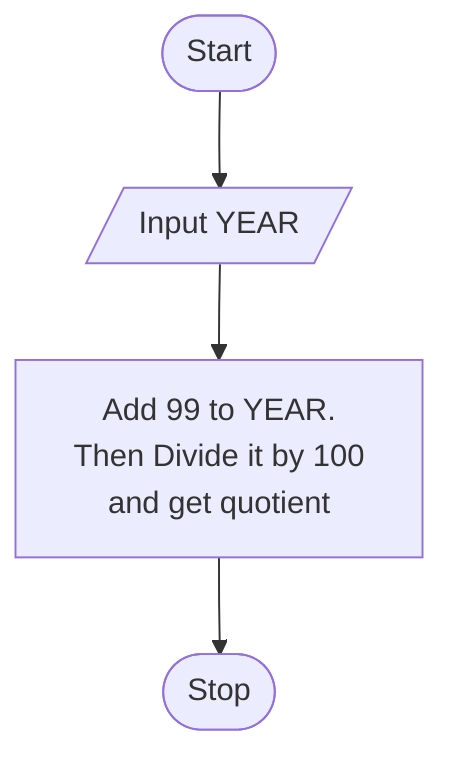

# Century From Year

Given a year, return the century it is in. The first century spans from the year 1 up to and including the year 100, the second - from the year 101 up to and including the year 200, etc.

## Example

- For `year = 1905`, the output should be

  ```:no-line-numbers
  century_from_year(year) = 20
  ```

- For `year = 1700`, the output should be

  ```:no-line-numbers
  century_from_year(year) = 17
  ```

## Chart



## Solution

:::: code-group
::: code-group-item PYTHON

@[code](./century-from-year.py)

:::

::: code-group-item JAVASCRIPT

@[code](./century-from-year.js)

:::

::: code-group-item TYPESCRIPT

@[code](./century-from-year.ts)

:::

::: code-group-item C#

@[code](./century-from-year.cs)

:::
::::
